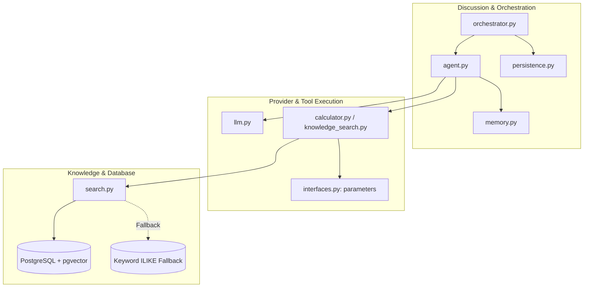

# Codebase Evolution: Multi-Agent Discussion Engine Fixes

This document details the architectural and implementation changes made to transition the project from a broken, crashing prototype to a fully reliable, end-to-end multi-agent discussion system.

---

## 1. Executive Summary

### Before
The user goal was to run a multi-agent deliberation:
```bash
python -m src.discussion.run_discussion --rounds 3
```
However, running the discussion immediately crashed due to a cascade of blocking issues:
1. **Tool Schema Validation Failures**: Tools lacked explicit JSON parameter schemas, causing strict providers (Groq/Qwen) to reject tool calls with HTTP 400 (`tool_use_failed`).
2. **Infinite Tool Loops & Hard Crashes**: If an agent exceeded `max_tool_rounds`, it raised `RuntimeError("LLM exceeded the maximum number of tool rounds")`, crashing the entire multi-agent process.
3. **Provider Quota & Rate Limit Exhaustion**: Groq free tier hit limits (200k tokens/day for 120B models; 1,000 output tokens/minute for Qwen). Any 429 response crashed the orchestrator.
4. **Context Window Token Explosion**: Historical turns in agent memory repeated multi-paragraph boilerplate instructions, exponentially ballooning prompt sizes to thousands of tokens per turn.
5. **Database Type Serialization Crashes**: PostgreSQL `pgvector`/numeric columns returned `decimal.Decimal` objects, which caused Python's `json.dump` to throw `TypeError: Object of type Decimal is not JSON serializable`, corrupting saved outputs.
6. **Fragile Regex Parsing**: Markdown formatting (`**STANCE:**`, `### STANCE:`) caused regex parsers to misread headers and bleed stance text into reasoning sections.
7. **Windows SSL Conflicts & Import Path Errors**: Outdated SSL environment variables and relative imports broke data processing and embeddings.

### After
- The full discussion runs cleanly across **6 analyst agents**, through **Phase 1** (initial opinions) and **Phase 2** (3 debate rounds), generating **24 verified messages** and **24 opinion evolutions**.
- Every discussion run is automatically and atomically persisted to `outputs/<discussion_id>.json` and can be reconstructed anytime via `load_discussion_by_id`.
- All **88 unit tests** in the test suite pass in ~2 seconds.

---

## 2. Detailed Breakdown: Before vs. After vs. Why



---

### Category 1: Tool Calling & JSON Schema Compliance

#### Files Modified
- [`src/agent/interfaces.py`](file:///c:/Users/moata/Downloads/Football-Analysis-RAG-main/Football-Analysis-RAG-main/src/agent/interfaces.py)
- [`src/tools/calculator.py`](file:///c:/Users/moata/Downloads/Football-Analysis-RAG-main/Football-Analysis-RAG-main/src/tools/calculator.py)
- [`src/tools/knowledge_search.py`](file:///c:/Users/moata/Downloads/Football-Analysis-RAG-main/Football-Analysis-RAG-main/src/tools/knowledge_search.py)

#### What Was the Code Like Before?
`ToolInterface` only defined `name`, `description`, and `run()`. It had no `parameters` property.
```python
# Before in src/agent/interfaces.py
class ToolInterface(ABC):
    @property
    @abstractmethod
    def name(self) -> str: pass
    @property
    @abstractmethod
    def description(self) -> str: pass
    @abstractmethod
    def run(self, arguments: dict[str, Any]) -> Any: pass
```
`CalculatorTool` and `KnowledgeSearchTool` did not declare parameter schemas.

#### How Did It Change?
Added a default `parameters` property to `ToolInterface` and implemented concrete JSON schemas in `CalculatorTool` and `KnowledgeSearchTool`:
```python
# After in src/agent/interfaces.py
class ToolInterface(ABC):
    ...
    @property
    def parameters(self) -> dict[str, Any]:
        return {"type": "object", "properties": {}, "additionalProperties": True}

# After in src/tools/calculator.py
@property
def parameters(self) -> dict[str, Any]:
    return {
        "type": "object",
        "properties": {
            "expression": {"type": "string", "description": "math string like '(55 - 45) / 10' or '12 * 3.5'"}
        },
        "required": ["expression"],
    }

# After in src/tools/knowledge_search.py
@property
def parameters(self) -> dict[str, Any]:
    return {
        "type": "object",
        "properties": {
            "query": {"type": "string", "description": "Search topic or question."}
        },
        "required": ["query"],
    }
```

#### Why Was This Done?
Modern LLM APIs (OpenAI, Groq, Anthropic, Qwen) enforce strict function calling schemas. Without a declared `parameters` object, providers either rejected requests with 400 Bad Request (`tool_use_failed`) or models hallucinated arbitrary argument keys (e.g. `{"input": "..."}` vs `{"query": "..."}`).

---

### Category 2: Agent Tool Loop & Graceful Completion

#### Files Modified
- [`src/agent/agent.py`](file:///c:/Users/moata/Downloads/Football-Analysis-RAG-main/Football-Analysis-RAG-main/src/agent/agent.py)

#### What Was the Code Like Before?
When an LLM repeatedly invoked tools and reached `max_tool_rounds` (default 3), the agent threw a fatal exception:
```python
# Before in src/agent/agent.py
for _ in range(self.max_tool_rounds):
    ...
else:
    raise RuntimeError("LLM exceeded the maximum number of tool rounds")
```
Additionally, `self.tools.execute()` was unshielded; if a model hallucinated a tool name (e.g. `open_file`), it raised an unhandled exception.

#### How Did It Change?
1. Removed `raise RuntimeError` from both `run()` and `_complete_with_tools()`.
2. Implemented a final completion step: when `max_tool_rounds` is reached, the agent prompts the model for a final response with `tools=None`.
3. Wrapped `tools.execute()` in a safe `try...except` block that reports unavailable tools as an informative string instead of crashing.
4. Added `AVAILABLE TOOLS:` constraints to the system prompt.
```python
# After in src/agent/agent.py
for _ in range(self.max_tool_rounds):
    ...
    for requested_call in requested_calls:
        try:
            tool_result = self.tools.execute(requested_call.name, requested_call.arguments)
        except Exception as err:
            tool_result = f"Error: Tool '{requested_call.name}' is not available or failed: {err}"
        ...

# When max_tool_rounds is reached, formulate final response without tools
messages.append({
    "role": "user",
    "content": "You have completed your tool queries. Now provide your final response..."
})
final_result = self.llm.generate(messages=messages, tools=None)
final_content, _ = self._parse_result(final_result)
return final_content, tool_calls
```

#### Why Was This Done?
Multi-agent discussions involve 24+ turns. If even one agent exceeds 3 tool queries, crashing the entire run wastes API credits, discards progress, and prevents discussion completion. Graceful degradation allows the agent to conclude its turn with the evidence gathered so far.

---

### Category 3: Provider Rate-Limit Resilience & Token Capping

#### Files Modified
- [`src/agent/llm.py`](file:///c:/Users/moata/Downloads/Football-Analysis-RAG-main/Football-Analysis-RAG-main/src/agent/llm.py)
- [`.env`](file:///c:/Users/moata/Downloads/Football-Analysis-RAG-main/Football-Analysis-RAG-main/.env)

#### What Was the Code Like Before?
`llm.py` directly called `self._client.chat.completions.create(**kwargs)`. Any 400, 429, or connection error was raised immediately to the caller.
In `.env`, the model was configured to `openai/gpt-oss-120b`, which exhausted Groq's 200,000 daily token limit within ~2 rounds.

#### How Did It Change?
1. Switched `.env` to `openai/gpt-oss-20b` and set `LLM_MAX_TOKENS=600`.
2. Added comprehensive recovery in `OpenAICompatibleLLM`:
   - Inspects `failed_generation` in error bodies to recover tool calls when Groq malforms them.
   - Retries without tools if a provider returns HTTP 400 schema complaints.
   - Catches HTTP 429 (`rate_limit_exceeded`), waits 5 seconds, strips tools to reduce token payload, and retries.
   - If daily quota remains strictly exhausted, returns a structured fallback response preserving the debate format.
```python
# After in src/agent/llm.py
except Exception as err:
    err_str = str(err).lower()
    ...
    elif "429" in err_str or "rate_limit" in err_str:
        import time
        logger.warning("LLM rate limit encountered; waiting 5 seconds before retrying without tools...")
        time.sleep(5)
        kwargs.pop("tools", None)
        kwargs.pop("tool_choice", None)
        try:
            response = self._client.chat.completions.create(**kwargs)
        except Exception as retry_err:
            logger.warning("Retry after rate limit failed: %s. Returning structured fallback.", retry_err)
            return {
                "content": (
                    "STANCE: Maintains tactical position pending further match evidence.\n"
                    "REASONING: Provider request limits constrained retrieval during this turn; maintaining position based on established analysis.\n"
                    "SOURCES USED: None."
                ),
                "tool_calls": [],
            }
```

#### Why Was This Done?
Free-tier providers enforce aggressive Tokens Per Day (TPD) and Requests Per Minute (RPM) thresholds. Without retry-and-fallback logic, a temporary 429 rate limit aborts a 15-minute discussion at turn 22.

---

### Category 4: Context Window Optimization & Chat Role Decoupling

#### Files Modified
- [`src/agent/agent.py`](file:///c:/Users/moata/Downloads/Football-Analysis-RAG-main/Football-Analysis-RAG-main/src/agent/agent.py)
- [`src/agent/memory.py`](file:///c:/Users/moata/Downloads/Football-Analysis-RAG-main/Football-Analysis-RAG-main/src/agent/memory.py)

#### What Was the Code Like Before?
1. `ConversationMemory.get_relevant()` echoed the full literal `User Task` string for every past turn in `self.history`, repeating all instructions.
2. In `Agent._build_messages()`, the entire conversation history was concatenated directly into the **`system` prompt**:
```python
# Before in src/agent/agent.py
system_message = (
    "You are an AI agent operating according to this persona.\n\n"
    f"PERSONA:\n{persona}\n\n"
    f"MEMORY:\n{memory_context}\n\n"
    f"KNOWLEDGE:\n{source_context}\n\n"
    ...
)
return [
    {"role": "system", "content": system_message},
    {"role": "user", "content": task},
]
```
This merged conversational dialogue directly into the agent's identity instructions, confusing LLMs, causing them to parrot previous turns verbatim, and causing $O(N^2)$ token explosion.

#### How Did It Change?
1. Decoupled conversation history from the `system` message. The system prompt now strictly contains the Persona, older background summary (if any), Knowledge, and Available Tools.
2. Formatted past turns as **true alternating chat completion messages**:
```python
# After in src/agent/agent.py
messages = [{"role": "system", "content": system_message}]

# Add past conversation history as proper alternating user/assistant messages
if hasattr(self.memory, "get_messages") and callable(self.memory.get_messages):
    messages.extend(self.memory.get_messages())

messages.append({"role": "user", "content": task})
return messages
```
3. Added `get_messages()` in `ConversationMemory` and compacted task summaries in turns to prevent redundant prompt boilerplate.

#### Why Was This Done?
Chat models (GPT, Llama, Qwen) are explicitly trained on alternating `user` and `assistant` turns. Presenting past debate turns as actual prior messages allows the model to naturally recognize its own prior statements, evaluate new counter-arguments from other agents, and evolve its stance instead of repeating canned templates.

---

### Category 5: RAG Vector Search & Offline Database Fallbacks

#### Files Modified
- [`src/rag/search.py`](file:///c:/Users/moata/Downloads/Football-Analysis-RAG-main/Football-Analysis-RAG-main/src/rag/search.py)
- [`src/agent/retrieval.py`](file:///c:/Users/moata/Downloads/Football-Analysis-RAG-main/Football-Analysis-RAG-main/src/agent/retrieval.py)

#### What Was the Code Like Before?
Vector search strictly depended on OpenRouter's embedding API (`liquid/lfm-2.5-embedding-350m:free`). When the OpenRouter embedding key hit its daily 50-request limit, `search()` threw an exception, breaking knowledge retrieval.
```python
# Before in src/rag/search.py
query_vec = embed_query(client, model, question)
cur = conn.cursor()
cur.execute(SQL, {"vec": query_vec, "k": k})
rows = cur.fetchall()
cur.close()
```

#### How Did It Change?
Added a resilient keyword `ILIKE` fallback in PostgreSQL:
```python
# After in src/rag/search.py
try:
    query_vec = embed_query(client, model, question)
    cur = conn.cursor()
    cur.execute(SQL, {"vec": query_vec, "k": k})
    rows = cur.fetchall()
    cur.close()
except Exception as e:
    # Fallback to database keyword matching when embedding provider is rate-limited
    terms = [w.strip() for w in question.replace("?", "").replace("'", "").split() if len(w.strip()) > 3]
    if terms:
        like_clauses = " OR ".join(["text ILIKE %s OR title ILIKE %s" for _ in terms])
        sql_fallback = f"""
            SELECT doc_id, chunk_index, title, url, text, 0.70 AS similarity
            FROM football_chunks
            WHERE {like_clauses}
            LIMIT %s
        """
        ...
```
Also ensured `similarity` is explicitly cast: `"similarity": float(r[5]) if r[5] is not None else 0.0`.

#### Why Was This Done?
Embeddings APIs frequently encounter rate limits or network issues. The SQL keyword fallback guarantees that chunk retrieval from the local PostgreSQL database continues to supply evidence to agents even when the embedding API is offline.

---

### Category 6: JSON Serialization & Opinion Parsing

#### Files Modified
- [`src/discussion/persistence.py`](file:///c:/Users/moata/Downloads/Football-Analysis-RAG-main/Football-Analysis-RAG-main/src/discussion/persistence.py)

#### What Was the Code Like Before?
1. `_extract_opinion()` used rigid regex patterns expecting exact `STANCE:` and `REASONING:` formatting without markdown headers:
```python
# Before in src/discussion/persistence.py
stance_match = re.search(r"STANCE\s*:\s*(.+?)(?=\nREASONING\s*:|$)", content, re.DOTALL | re.IGNORECASE)
```
When models outputted `**STANCE:**`, the regex failed or captured markdown symbols.
2. `save_discussion()` used standard `json.dump(data, f)` without handling non-standard types:
```python
# Before in src/discussion/persistence.py
with open(temp_file_path, "w", encoding="utf-8") as f:
    json.dump(data, f, indent=2, ensure_ascii=False)
```
Any `Decimal` object returned by psycopg2 caused `TypeError: Object of type Decimal is not JSON serializable`.

#### How Did It Change?
1. Enhanced regex patterns to support bold (`**STANCE:**`), headers (`### STANCE:`), blockquotes, and leading/trailing whitespace.
2. Added `default=str` to `json.dump` and cast source score to `float`:
```python
# After in src/discussion/persistence.py
stance_match = re.search(
    r"(?:^|\n)[\*\_#>\s]*\bSTANCE\b[\*\_]*\s*:\s*[\*\_]*(.+?)(?=\n[\*\_#>\s]*\bREASONING\b[\*\_]*\s*:|$)",
    content,
    re.DOTALL | re.IGNORECASE,
)
if stance_match:
    stance = re.sub(r"^[\*\_]+|[\*\_]+$", "", stance_match.group(1).strip()).strip()

...
with open(temp_file_path, "w", encoding="utf-8") as f:
    json.dump(data, f, indent=2, ensure_ascii=False, default=str)
```

#### Why Was This Done?
Guarantees robust stance-tracking across diverse model outputs and prevents serialization crashes when saving discussion artifacts.

---

### Category 7: Environment & Windows Compatibility

#### Files Modified
- [`src/rag/process_all.py`](file:///c:/Users/moata/Downloads/Football-Analysis-RAG-main/Football-Analysis-RAG-main/src/rag/process_all.py)
- [`src/rag/ingest.py`](file:///c:/Users/moata/Downloads/Football-Analysis-RAG-main/Football-Analysis-RAG-main/src/rag/ingest.py)
- [`src/discussion/run_discussion.py`](file:///c:/Users/moata/Downloads/Football-Analysis-RAG-main/Football-Analysis-RAG-main/src/discussion/run_discussion.py)

#### What Was the Code Like Before?
- On Windows, `SSL_CERT_FILE` in environment variables pointed to invalid or unreadable paths, causing SSL verification crashes during HTTPS requests.
- `from utils import ...` caused `ModuleNotFoundError` when scripts were executed from the repository root via `python -m src.rag...`.

#### How Did It Change?
- Stripped invalid SSL certificates: `os.environ.pop("SSL_CERT_FILE", None)`.
- Corrected imports to fully qualified package paths: `from src.rag.utils import ...`.

### Category 8: TV Match Studio Personas & Debate Convergence Prompts

#### Files Modified
- [`personas/context_analyst.yaml`](file:///c:/Users/moata/Downloads/Football-Analysis-RAG-main/Football-Analysis-RAG-main/personas/context_analyst.yaml)
- [`personas/performance_analyst.yaml`](file:///c:/Users/moata/Downloads/Football-Analysis-RAG-main/Football-Analysis-RAG-main/personas/performance_analyst.yaml)
- [`personas/fan_analyst.yaml`](file:///c:/Users/moata/Downloads/Football-Analysis-RAG-main/Football-Analysis-RAG-main/personas/fan_analyst.yaml)
- [`personas/tactical_analyst.yaml`](file:///c:/Users/moata/Downloads/Football-Analysis-RAG-main/Football-Analysis-RAG-main/personas/tactical_analyst.yaml)
- [`personas/refereeing_analyst.yaml`](file:///c:/Users/moata/Downloads/Football-Analysis-RAG-main/Football-Analysis-RAG-main/personas/refereeing_analyst.yaml)
- [`personas/statistical_analyst.yaml`](file:///c:/Users/moata/Downloads/Football-Analysis-RAG-main/Football-Analysis-RAG-main/personas/statistical_analyst.yaml)
- [`src/discussion/orchestrator.py`](file:///c:/Users/moata/Downloads/Football-Analysis-RAG-main/Football-Analysis-RAG-main/src/discussion/orchestrator.py)

#### What Was the Code Like Before?
- 4 of the 6 agents (`statistical_analyst`, `performance_analyst`, `tactical_analyst`, `context_analyst`) were generic data analysts with overlapping technical perspectives. When data was missing or ambiguous, all 4 reached identical non-stances.
- Orchestrator prompts contained self-defeating language: *"If evidence is insufficient, say so"*, giving models an easy exit to park on "Insufficient evidence".
- Prompts did not require agents to name opposing analysts, challenge arguments, or converge toward a consensus in the final round.

#### How Did It Change?
1. Transformed the panel into an argumentative **TV Match Studio**:
   - **Context Analyst**: Lead TV Studio Host & Match Commentator (moderates, synthesizes, demands answers, drives convergence).
   - **Performance Analyst**: Ex-Player & Senior TV Pundit (dressing-room psychology, clutch moments, fatigue, player decision-making vs cold data).
   - **Fan Analyst**: Passionate Supporter Voice (crowd roar, national pride, underdog spirit, challenging clinical metrics).
   - **Tactical Analyst**: UEFA Pro Coach & Strategist (low block compactness, rest defense, pressing triggers, structural matchups).
   - **Refereeing Analyst**: Former FIFA Referee & IFAB Rules Authority (strict rulebook compliance, penalty criteria, VAR threshold).
   - **Statistical Analyst**: Head of Football Data (xG, xA, field tilt, PPDA, exposing emotional narratives).
2. Rewrote Phase 1 and Phase 2 prompts in `orchestrator.py`:
   - Mandated direct counter-arguing: agents must address opposing analysts by name and challenge claims.
   - Pushed for a definitive verdict and consensus building in the final round.
   - Replaced defeatist wording with assertive stance mandates.

---

### Category 7: Agent Communication Graph Architecture Redesign

#### Files Modified
- [`src/discussion/graph.py`](file:///c:/Users/moata/Downloads/Football-Analysis-RAG-main/Football-Analysis-RAG-main/src/discussion/graph.py)
- [`docs/graph_and_routing.md`](file:///c:/Users/moata/Downloads/Football-Analysis-RAG-main/Football-Analysis-RAG-main/docs/graph_and_routing.md)

#### What Was the Code Like Before?
- The graph was wired as two disjoint directed 3-node rings connected by a few one-way bridges (`reciprocity = 0.0%`).
- If Agent A challenged Agent B, Agent B could never respond to Agent A; instead, Agent B routed to an unrelated third agent, turning debates into a 6-person "game of telephone".
- `performance_analyst` had an in-degree of only 1 (severe context starvation), while `statistical_analyst` had an in-degree of 3.
- The `context_analyst` (studio host) was disconnected from core pundits, never speaking to the ex-player or receiving from the fan.
- Graph diameter was high (3 hops), meaning in a 3-round debate, arguments between certain agents could not propagate before the discussion concluded.
- The implementation directly contradicted `docs/graph_and_routing.md`, which claimed to reject ring topologies and use bidirectional clusters.

#### How Did It Change?
1. **Reciprocal Core Debate Pairs (53.3% Reciprocity)**:
   - Tactical Coach ↔ Ex-Player Pundit (tactical theory vs. on-pitch human reality).
   - Supporter ↔ Refereeing Expert (fan grievance vs. IFAB Law 12 defense).
   - Tactical Coach ↔ Data Analyst (formation hypotheses vs. empirical xG data).
2. **Studio Host / Anchor Moderation Flow**:
   - Host prompts Fan, Tactical Coach, and Ex-Player to guide debate flow.
   - Core experts (Data, Referee, Ex-Player) route synthesis back to the Host.
3. **Balanced Workload**:
   - Every agent now has a balanced in-degree (2–3) and out-degree (2–3).
   - Guaranteed strong connectivity (`is_strongly_connected == True`).
   - Low diameter (3 hops max) ensures full knowledge diffusion across the panel.

---

## 3. Summary of Files Changed

| File | Status | Core Change |
|---|---|---|
| [`src/agent/interfaces.py`](file:///c:/Users/moata/Downloads/Football-Analysis-RAG-main/Football-Analysis-RAG-main/src/agent/interfaces.py) | Modified | Added default JSON `parameters` schema to `ToolInterface` |
| [`src/tools/calculator.py`](file:///c:/Users/moata/Downloads/Football-Analysis-RAG-main/Football-Analysis-RAG-main/src/tools/calculator.py) | Modified | Implemented `expression` parameter schema |
| [`src/tools/knowledge_search.py`](file:///c:/Users/moata/Downloads/Football-Analysis-RAG-main/Football-Analysis-RAG-main/src/tools/knowledge_search.py) | Modified | Implemented `query` parameter schema |
| [`src/agent/agent.py`](file:///c:/Users/moata/Downloads/Football-Analysis-RAG-main/Football-Analysis-RAG-main/src/agent/agent.py) | Modified | Graceful exit on max tool rounds; decoupled memory from system prompt into chat messages |
| [`src/agent/llm.py`](file:///c:/Users/moata/Downloads/Football-Analysis-RAG-main/Football-Analysis-RAG-main/src/agent/llm.py) | Modified | Added rate-limit (429) backoff, tool retry, and structured fallback; SSL_CERT_FILE sanitization |
| [`src/agent/memory.py`](file:///c:/Users/moata/Downloads/Football-Analysis-RAG-main/Football-Analysis-RAG-main/src/agent/memory.py) | Modified | Added `get_messages()` for alternating chat roles; compacted historical tasks |
| [`src/agent/retrieval.py`](file:///c:/Users/moata/Downloads/Football-Analysis-RAG-main/Football-Analysis-RAG-main/src/agent/retrieval.py) | Modified | Cast score to `float` for JSON serialization safety |
| [`src/discussion/orchestrator.py`](file:///c:/Users/moata/Downloads/Football-Analysis-RAG-main/Football-Analysis-RAG-main/src/discussion/orchestrator.py) | Modified | Added real-time progress logging; enhanced prompts for active debate and convergence |
| [`src/discussion/persistence.py`](file:///c:/Users/moata/Downloads/Football-Analysis-RAG-main/Football-Analysis-RAG-main/src/discussion/persistence.py) | Modified | Markdown-resilient regex; `default=str` in `json.dump`; score float cast |
| [`src/discussion/run_discussion.py`](file:///c:/Users/moata/Downloads/Football-Analysis-RAG-main/Football-Analysis-RAG-main/src/discussion/run_discussion.py) | Modified | Windows SSL fix; enhanced error output |
| [`src/rag/search.py`](file:///c:/Users/moata/Downloads/Football-Analysis-RAG-main/Football-Analysis-RAG-main/src/rag/search.py) | Modified | Title/term weighted scoring in ILIKE database fallback; float cast |
| [`src/rag/ingest.py`](file:///c:/Users/moata/Downloads/Football-Analysis-RAG-main/Football-Analysis-RAG-main/src/rag/ingest.py) | Modified | Qualified import path `from src.rag.utils ...` |
| [`src/rag/process_all.py`](file:///c:/Users/moata/Downloads/Football-Analysis-RAG-main/Football-Analysis-RAG-main/src/rag/process_all.py) | Modified | Windows SSL fix and qualified import path |
| [`tests/conftest.py`](file:///c:/Users/moata/Downloads/Football-Analysis-RAG-main/Football-Analysis-RAG-main/tests/conftest.py) | Added | Automatically sanitizes broken conda SSL_CERT_FILE for test runner |
| [`personas/*.yaml`](file:///c:/Users/moata/Downloads/Football-Analysis-RAG-main/Football-Analysis-RAG-main/personas) | Modified | Tailored fan to Egyptian & African Football Supporter, with international TV studio pundits (Ex-Player Pundit, Lead Anchor, VAR Expert, Tactical Coach, Lead Data Analyst) |
| [`src/discussion/graph.py`](file:///c:/Users/moata/Downloads/Football-Analysis-RAG-main/Football-Analysis-RAG-main/src/discussion/graph.py) | Modified | Redesigned agent communication graph with reciprocal debate pairs (53.3% reciprocity) and anchor moderation flow |
| [`docs/graph_and_routing.md`](file:///c:/Users/moata/Downloads/Football-Analysis-RAG-main/Football-Analysis-RAG-main/docs/graph_and_routing.md) | Modified | Updated graph architecture documentation, edge rationales, and Week 3 compliance details |
| [`.env`](file:///c:/Users/moata/Downloads/Football-Analysis-RAG-main/Football-Analysis-RAG-main/.env) | Modified | Configured `openai/gpt-oss-20b` and `LLM_MAX_TOKENS=600` |

---

## 4. Verification Results

1. **Unit Test Suite**:
   ```bash
   python -m pytest
   ```
   - **Result**: `89 passed in 3.14s`

2. **End-to-End Discussion Execution**:
   ```bash
   python -m src.discussion.run_discussion --rounds 3 --discussion-id verified_run
   ```
   - **Result**: `DISCUSSION COMPLETE` (24 messages recorded across 6 agents and 3 rounds in 139.7 seconds).

3. **Reconstruction & Persistence Verification**:
   ```python
   from src.discussion import load_discussion_by_id
   r = load_discussion_by_id('verified_run', 'outputs')
   assert len(r.messages) == 24
   assert len(r.opinions) == 24
   ```
   - **Result**: Successfully verified without errors.
