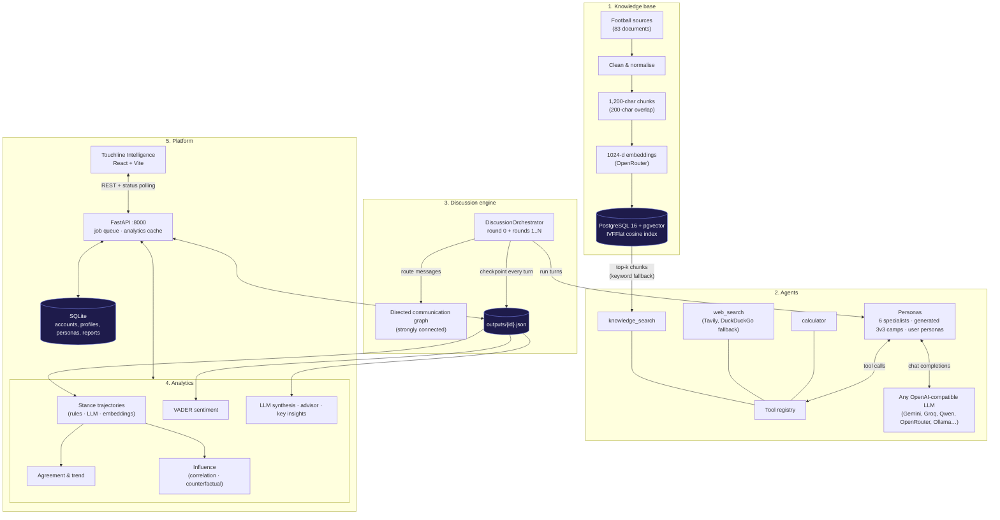
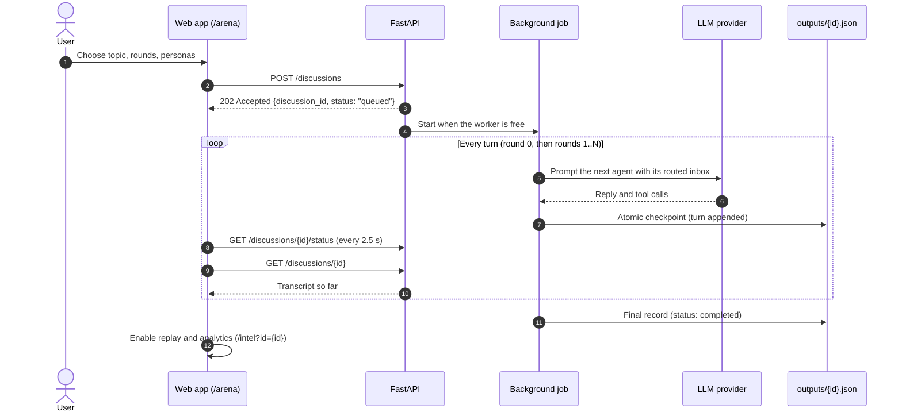
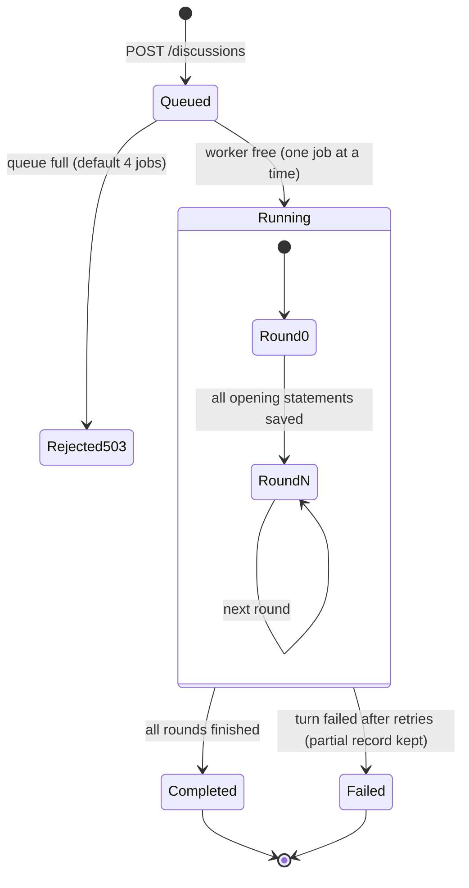

# Football Analysis RAG — Multi-Agent Deliberation & Intelligence Platform

A platform where AI football analysts **debate a question in structured rounds**,
grounded in a football knowledge base, and the debate is then **measured**:
how each agent's stance moved, whether the group converged, who influenced whom,
and what the final recommendation is. It all runs in the **Touchline
Intelligence** web app.

- **Knowledge base (RAG):** 83 football sources (tactics, analytics, IFAB laws, match reports) chunked, embedded and searched with PostgreSQL + pgvector.
- **Agents:** LLM personas with memory and tools (`knowledge_search`, `web_search`, `calculator`). Use the six built-in specialists, LLM-generated 3v3 opposing camps, or your own personas.
- **Deliberation:** agents exchange messages along a directed communication graph over 1–10 rounds, with a checkpoint after every turn.
- **Analytics:** stance trajectories, agreement, influence (correlation and optional counterfactual), VADER sentiment, charts, Markdown reports, and an LLM synthesis and advisor decision.
- **Platform:** FastAPI backend with a background job queue, accounts, profiles, custom personas and reports; React + Vite frontend.

---

## Table of contents

- [Architecture](#architecture)
- [How a debate runs](#how-a-debate-runs)
- [Agents and personas](#agents-and-personas)
- [Web app](#web-app)
- [Project structure](#project-structure)
- [Prerequisites](#prerequisites)
- [Setup](#setup)
- [Running](#running)
- [Building the knowledge base](#building-the-knowledge-base)
- [Analytics from the command line](#analytics-from-the-command-line)
- [API overview](#api-overview)
- [Configuration reference](#configuration-reference)
- [Testing](#testing)
- [Design decisions](#design-decisions)
- [Known limitations](#known-limitations)
- [Documentation](#documentation)

---

## Architecture



---

## How a debate runs

1. **Round 0 — opening statements.** Every agent retrieves evidence and gives an initial opinion.
2. **Rounds 1…N.** Each agent receives the previous round's messages from its neighbours in the communication graph and replies, using tools as needed.
3. **Checkpoints.** The record in `outputs/{id}.json` is atomically rewritten after every completed turn, so a live run can be watched and a failed run keeps its partial history.





Retries for rate limits and provider errors are bounded (by default 3 retries,
at most 120 s per wait, then short paced attempts). A provider that demands a
longer wait fails the turn instead of stalling the worker. See
[reliability and checkpointing](docs/reliability-and-checkpointing.md).

---

## Agents and personas

There are three ways to choose who debates. All of them work from the web app,
the API and the CLI:

| Mode | Agents | Communication graph |
|---|---|---|
| **Specialists** (default) | 2–6 of: Tactical, Statistical, Performance, Context (studio host), Refereeing, Fan analyst (`personas/*.yaml`) | 6 agents: a curated 15-edge graph. 2–5 agents: a ring with chords |
| **Dynamic camps** | The LLM generates two opposing camps for the topic, each with a coach, a fan and a pundit (cached in `personas/generated/<id>/`) | 6 agents: a symmetrical 3v3 graph with 16 edges |
| **Chosen personas** | Any 2–6 system or user-created personas, optionally split into Camp A and Camp B | Ring with chords |

Every graph is verified to be **strongly connected** (`nx.is_strongly_connected`),
so every argument can reach every agent. Diagrams and edge lists:
[agent graph and routing](docs/agent-graph-and-routing.md).

Agents keep a summarised memory window, retrieve 6 knowledge-base chunks per
query, fall back to keyword search if the embedding provider is down, and cite
numbered sources in a fixed `STANCE / REASONING / SOURCES USED` format
([memory and retrieval](docs/agent-memory-and-retrieval.md),
[prompt design](docs/prompt-design.md)).

---

## Web app

| Page | URL | What it does |
|---|---|---|
| **Landing** | `/` | Animated pitch hero and quick start |
| **Arena** | `/arena` | Pick a topic, 2–5 rounds and the personas (dynamic camps or chosen personas); watch turns stream in; replay a finished debate |
| **History** | `/history` | Past and in-flight debates with live status |
| **Intelligence** | `/intel?id=…` | Stance trajectories, agreement, influence, sentiment, synthesis and advisor decision |
| **DevOps** | `/devops` | API health and system telemetry |

Signing in (optional) unlocks a profile, saved memory, custom personas and
personal reports. Details: [frontend/README.md](frontend/README.md).

---

## Project structure

```text
Football-Analysis-RAG/
├── src/
│   ├── ingestion/            # collect.py, clean.py: gather and clean source articles
│   ├── rag/                  # chunk, embed, ingest to pgvector, search, evaluate
│   ├── agent/                # Agent loop, LLM adapter, memory, retrieval, personas, prompts/
│   ├── tools/                # knowledge_search, web_search, calculator
│   ├── discussion/           # orchestrator, graph, router, persistence, run_discussion CLI
│   ├── analytics/            # stance, agreement, influence, sentiment, causal, synthesis, advisor
│   ├── visualization/        # opinion trajectory chart, interaction graph (matplotlib)
│   ├── reporting/            # Markdown report generator
│   ├── api/                  # FastAPI app, routes, schemas, services (job queue, analytics cache)
│   ├── platform/             # SQLite: auth, profiles, memory, personas, reports
│   └── utils/
├── frontend/                 # React + Vite multi-page app (see frontend/README.md)
├── personas/                 # the six specialist persona YAMLs; generated/ for LLM camps
├── sql/                      # init_db.sql (pgvector schema), migrations/
├── scripts/                  # manual testers, embedding resume, offline discussion viewer
├── tests/                    # pytest suite (offline)
├── docs/                     # reference documentation
├── data/                     # raw/clean corpus and embeddings (gitignored), platform DB
├── outputs/                  # saved discussions (gitignored)
├── reports/                  # charts, reports, api_cache/
├── Dockerfile, docker-compose.yml, DEPLOYMENT.md
└── requirements.txt, requirements-analytics-embeddings.txt
```

---

## Prerequisites

- **Python 3.10+** (the Docker image uses 3.11)
- **Node.js 18+** and npm, for the frontend
- **Docker**, or a local PostgreSQL 16 with the `pgvector` extension, for the knowledge base
- An **OpenAI-compatible chat LLM** endpoint with tool calling ([options](docs/llm-providers.md))
- An **OpenRouter** key for embeddings (the knowledge base uses `liquid/lfm-2.5-embedding-350m:free`)

Without PostgreSQL the debates still run: retrieval returns no sources and
agents rely on their persona knowledge and web search.

---

## Setup

```bash
git clone https://github.com/Moataz-hindy/Football-Analysis-RAG.git
cd Football-Analysis-RAG

python -m venv .venv
source .venv/bin/activate            # Windows: .venv\Scripts\activate
pip install -r requirements.txt

cp .env.example .env                 # then fill in your keys (see below)

npm --prefix frontend install
```

Minimum `.env`:

```ini
# Chat LLM (any OpenAI-compatible provider, see docs/llm-providers.md)
LLM_API_KEY=your_key
LLM_BASE_URL=https://generativelanguage.googleapis.com/v1beta/openai/
LLM_MODEL=gemini-2.5-flash

# Embeddings for the knowledge base (keep this model)
OPENAI_API_KEY=your_openrouter_key
OPENROUTER_MODEL=liquid/lfm-2.5-embedding-350m:free

# PostgreSQL + pgvector
DB_HOST=localhost
DB_PORT=5432
DB_NAME=football_intelligence
DB_USER=postgres
DB_PASSWORD=your_password
```

All other settings are optional; see [Configuration reference](#configuration-reference).

---

## Running

### Option A — Development (hot reload)

```bash
docker compose up -d postgres                                   # knowledge base
python -m uvicorn src.api.main:app --port 8000 --reload         # API
npm --prefix frontend run dev                                   # web app
```

Open **http://localhost:3000**. The Vite dev server forwards API calls to port 8000.

### Option B — API serves the built app

```bash
npm --prefix frontend run build
python -m uvicorn src.api.main:app --port 8000
```

Open **http://localhost:8000** (pages at `/arena`, `/history`, `/intel`,
`/devops`). API docs are at **http://localhost:8000/docs**.

### Option C — Docker Compose

```bash
docker compose up --build -d         # serves the committed frontend/dist
                                     # after frontend changes: npm --prefix frontend run build first
```

App at http://localhost:8000. See [DEPLOYMENT.md](DEPLOYMENT.md).

### Option D — Command line

```bash
# 2 specialists, 3 rounds, fixed ID
python -m src.discussion.run_discussion \
  --topic "Evaluate Argentina's defensive transition against France in the 2022 Final" \
  --agents 2 --rounds 3 --discussion-id arg-fra-2p

# LLM-generated 3v3 camps
python -m src.discussion.run_discussion \
  --topic "Did Japan's 5-4-1 low block expose Spain's central progression limits?" \
  --dynamic-personas
```

Other flags: `--persona-ids`, `--camp-a-ids`, `--camp-b-ids`,
`--force-regenerate`, `--output-dir`, `--personas-dir`, and `--overwrite` to
replace an existing ID. The result is saved to `outputs/{discussion_id}.json`.
To read a saved debate offline, run
`python scripts/render_discussion.py outputs/arg-fra-2p.json` and open the
resulting `.html` file.

---

## Building the knowledge base

The corpus files under `data/` are not in git. With PostgreSQL running and the
embedding key set:

```bash
python -m src.ingestion.collect            # download source articles → data/raw
python -m src.ingestion.clean              # strip HTML, fix encoding → data/clean
python -m src.rag.process_all              # chunk and embed data/clean → data/embeddings
python -m src.rag.ingest                   # load embeddings into pgvector
python -m src.rag.search "What is a low block?"
python -m src.rag.evaluate                 # retrieval benchmark (Precision@5, Recall@5, MRR)
```

`sql/init_db.sql` creates the schema automatically when the Compose Postgres
container starts. For quota-limited embedding runs, use
`python scripts/continue_embeddings.py --repo . --resume`
([manual testing](docs/manual-testing.md)).

---

## Analytics from the command line

The web app computes analytics automatically. To run the pipeline yourself:

```bash
# Default: conservative local rules, no API calls
python -m src.analytics.run_analytics \
  --input outputs/arg-fra-2p.json \
  --output outputs/analytics-arg-fra-2p.json \
  --generate-charts --generate-report --reports-dir reports

# LLM stance scoring requires two explicit poles
python -m src.analytics.run_analytics \
  --input outputs/arg-fra-2p.json \
  --output outputs/analytics-arg-fra-2p.json \
  --use-llm \
  --positive-pole "Argentina's defensive transition was effective" \
  --negative-pole "Argentina's defensive transition was ineffective"
```

Without `--output`, nothing is saved and only a summary is printed. Optional
extras: `--counterfactual-ablation`, `--key-insights`, `--use-embeddings` (needs
`requirements-analytics-embeddings.txt` and a locally cached model),
`--scores-from` (reuse earlier scores).

| Output | Meaning |
|---|---|
| Stance trajectories | Each agent's position per round on a −1…+1 scale; unclassifiable stances stay `null` |
| Agreement | `1 − mean pairwise distance / 2` per round; trend Converging / Stable / Diverging |
| Influence | Pearson correlation between a sender's stance gap and the recipient's next move; optional LLM counterfactual estimate |
| Sentiment | VADER tone per message (tone, not agreement) |
| Charts & report | Trajectory chart, interaction graph, Markdown report in `reports/` |

Formulas, statuses and limitations: [docs/analytics.md](docs/analytics.md).

---

## API overview

| Method | Endpoint | Description |
|---|---|---|
| `GET` | `/health` | Liveness check |
| `GET` | `/topics` | Curated debate topics |
| `GET` / `POST` | `/discussions` | List discussions / start one (202; `topic`, `num_rounds` 1–10, `num_agents` 2–6, persona options) |
| `GET` | `/discussions/{id}` | Full transcript and configuration |
| `GET` | `/discussions/{id}/status` | `queued` · `running` · `completed` · `failed` |
| `GET` | `/discussions/{id}/analytics` | Trajectories, agreement, influence, sentiment (cached) |
| `GET` / `POST` | `/discussions/{id}/causal-analysis` | Counterfactual influence (LLM, get-or-compute) |
| `GET` / `POST` | `/discussions/{id}/synthesis` | LLM executive summary (get-or-compute, cached) |
| `GET` / `POST` | `/discussions/{id}/advisor` | LLM final decision (get-or-compute, cached) |
| | `/auth/*`, `/profile/*`, `/reports/*` | Accounts, profile, memory, custom personas, reports (Bearer token) |

The full list of all 32 endpoints is in [docs/api-reference.md](docs/api-reference.md);
interactive docs are at `/docs`.

---

## Configuration reference

| Variable | Default | Purpose |
|---|---|---|
| `LLM_API_KEY`, `LLM_BASE_URL`, `LLM_MODEL` | — (required) | Chat LLM provider |
| `LLM_TEMPERATURE` | `0.2` | Sampling temperature (recorded per run) |
| `LLM_SEED` | — | Recorded in run metadata |
| `LLM_MAX_TOKENS` | `1024` | Maximum reply length |
| `LLM_TIMEOUT_SECONDS` | `60` | Request timeout |
| `LLM_MAX_RETRIES` | `3` | Retries for rate limits and transient errors |
| `LLM_RETRY_MAX_WAIT_SECONDS` | `120` | Longest single retry wait before failing the turn |
| `LLM_PACE_WAITS` | `3,8,15` | Extra paced attempts after the retry budget |
| `LLM_PACER_MAX_PER_MINUTE`, `LLM_PACER_MAX_PER_HOUR` | `0` (off) | Client-side request caps |
| `OPENAI_API_KEY`, `OPENROUTER_MODEL` | — | Embedding provider for the knowledge base |
| `DB_HOST`, `DB_PORT`, `DB_NAME`, `DB_USER`, `DB_PASSWORD` | `localhost`, `5432`, `football_intelligence`, `postgres`, `postgres` | PostgreSQL + pgvector |
| `TAVILY_API_KEY` | — | Web search via Tavily (otherwise DuckDuckGo) |
| `DISCUSSION_QUEUE_DEPTH` | `4` | Discussions accepted at once (one runs, the rest wait) |
| `CORS_ORIGINS` | localhost 3000 / 5173 / 8501 | Allowed browser origins |
| `PORT` | `8000` | API port (Docker Compose) |

---

## Testing

```bash
python -m pytest tests -q                        # full offline suite
python -m pytest tests/test_platform.py -v       # accounts, profiles, personas
python -m pytest tests/test_graph_routing.py -v  # graph connectivity
```

The suite blocks network access and makes no LLM, web or database calls. Live
checks are described in [manual testing](docs/manual-testing.md).

---

## Design decisions

| Area | Decision | Why |
|---|---|---|
| LLM access | One OpenAI-compatible adapter | Switch providers by editing three `.env` lines |
| Communication | Directed, strongly connected graph instead of a broadcast | Small, targeted inboxes and real two-way rebuttals |
| Persistence | Atomic checkpoint after every turn | Live progress in the UI; partial history survives failures |
| Failures | Failed tools and searches are errors, never evidence | Infrastructure problems cannot pose as sources |
| Retries | Bounded retries with a maximum wait | A quota wall fails a turn instead of blocking the worker for hours |
| Job queue | One worker, bounded queue (503 when full) | Protects free-tier LLM quotas |
| Stances | Unclassifiable stances stay `null` | No invented curves; coverage is reported with every result |
| Influence | Reported as association, with limitations attached | A few rounds cannot establish causation |
| Platform data | SQLite, separate from pgvector | Accounts and personas work without the knowledge-base database |

---

## Known limitations

- **Committed frontend build:** `frontend/dist/` is in git so the Docker image
  (and a fresh clone) serves the app without Node. The Dockerfile does not build
  it, so after changing anything in `frontend/src`, run
  `npm --prefix frontend run build` and commit the new `dist/`.
- **Knowledge base not in git:** `data/raw`, `data/clean` and `data/embeddings`
  are gitignored, so a new environment must rebuild the corpus, or run debates
  without retrieval.
- **Analytics are experimental:** stance scores are model or rule estimates on a
  handful of rounds; read `metadata.scored_snapshots` and each result's
  `limitations`.
- **Free-tier LLMs throttle:** a 6-agent debate makes dozens of requests; see the
  pacing settings in [LLM providers](docs/llm-providers.md).

---

## Documentation

| Document | Contents |
|---|---|
| [docs/README.md](docs/README.md) | Index of all documentation |
| [docs/discussion-engine.md](docs/discussion-engine.md) | Debate lifecycle, saved JSON schema, reproducibility |
| [docs/agent-graph-and-routing.md](docs/agent-graph-and-routing.md) | Communication graphs and routing |
| [docs/agent-memory-and-retrieval.md](docs/agent-memory-and-retrieval.md) | Memory window, retrieval and fallbacks |
| [docs/prompt-design.md](docs/prompt-design.md) | Prompt structure and rationale |
| [docs/reliability-and-checkpointing.md](docs/reliability-and-checkpointing.md) | Failure handling, retries, checkpoints |
| [docs/analytics.md](docs/analytics.md) | Analytics formulas, CLI and outputs |
| [docs/api-reference.md](docs/api-reference.md) | All REST endpoints |
| [docs/llm-providers.md](docs/llm-providers.md) | Provider setup and tuning |
| [docs/retrieval-evaluation.md](docs/retrieval-evaluation.md) | Retrieval benchmark |
| [docs/manual-testing.md](docs/manual-testing.md) | Live manual checks |
| [frontend/README.md](frontend/README.md) | Web app architecture and development |
| [DEPLOYMENT.md](DEPLOYMENT.md) | Docker deployment |
