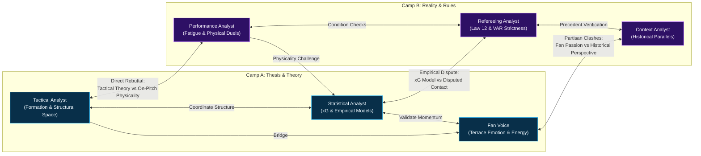
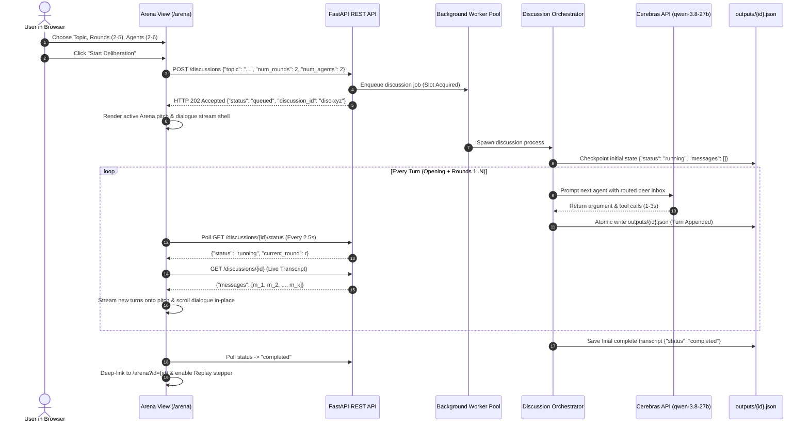
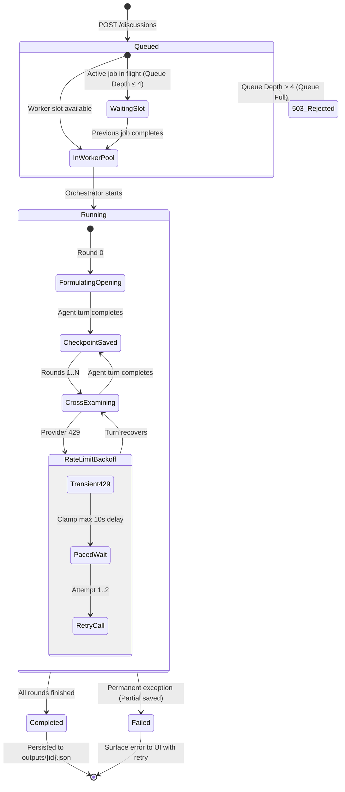

# Football Analysis RAG — Multi-Agent Deliberation & Intelligence Platform

A **multi-agent football intelligence and dialectical deliberation platform**. The system ingests professional football domain knowledge, orchestrates multi-agent tactical debates along strongly-connected passing graphs, tracks real-time opinion trajectories, calculates counterfactual causal influence, and serves an interactive **Touchline Intelligence** multi-page web application.

---

## Visual Architecture Overview

```mermaid
flowchart TD
    subgraph KNOWLEDGE ["1. Knowledge Infrastructure"]
        RAW["Football Web Sources<br/>(80+ tactical articles, IFAB laws)"] --> CLEAN["Text Cleaner & Normaliser"]
        CLEAN --> CHUNK["1,200-Char Chunking<br/>(200-char overlap)"]
        CHUNK --> EMBED["1024-D Embeddings Engine"]
        EMBED --> VDB[("PostgreSQL 16 + pgvector<br/>(IVFFlat cosine index)")]
        VDB -.->|"graceful fallback"| SQLITE[("Embedded SQLite 3 DB")]
    end

    subgraph AGENTS ["2. Autonomous Specialist Personas"]
        VDB -->|"vector retrieval (top-k)"| RAG_TOOL["KnowledgeSearchTool"]
        WEB_TOOL["WebSearchTool (Tavily)"]
        CALC_TOOL["CalculatorTool (xG / math)"]
        
        P1["Tactical Analyst<br/>(Half-space & Spatial)"]
        P2["Statistical Analyst<br/>(xG & Empirical Models)"]
        P3["Performance Analyst<br/>(Fatigue, Sprints & Press)"]
        P4["Context Analyst<br/>(Historical Precedents)"]
        P5["Refereeing Analyst<br/>(Law 12 & VAR Protocol)"]
        P6["Fan Voice<br/>(Terrace Sentiment)"]

        TOOLS["Tool Registry"] --- RAG_TOOL
        TOOLS --- WEB_TOOL
        TOOLS --- CALC_TOOL

        P1 & P2 & P3 & P4 & P5 & P6 <-->|"agent loop & tool calls"| TOOLS
        P1 & P2 & P3 & P4 & P5 & P6 <-->|"fast inference (~1-3s)"| LLM["Cerebras API<br/>(qwen-3.8-27b)"]
    end

    subgraph ORCHESTRATION ["3. Dialectical Discussion Orchestrator"]
        GRAPH["NetworkX Passing Graph<br/>(Ring & Chord Topology)"]
        ROUTER["GraphRouter (Stateless Message Passing)"]
        ROUTER -->|"route turn messages"| GRAPH
        
        ORCH["DiscussionOrchestrator<br/>(Opening Statements + N Rounds)"]
        ORCH -->|"dispatch turns"| P1 & P2 & P3 & P4 & P5 & P6
        ORCH -->|"turn-by-turn checkpoint"| DISK[("Disk Storage<br/>outputs/{id}.json")]
    end

    subgraph ANALYTICS ["4. Intelligence Analytics Engine"]
        DISK -->|"read transcript"| ENGINE["AnalyticsEngine"]
        ENGINE --> TASK1["Task 1: Stance Trajectories<br/>[-1.0, +1.0] Numeric Shifts"]
        ENGINE --> TASK2["Task 2: Pairwise Consensus<br/>A = 1 - D_mean / 2"]
        ENGINE --> TASK3["Task 3: Counterfactual Causal Ablation<br/>Persuasion Impact (τ)"]
        ENGINE --> TASK4["Task 4: VADER Sentiment<br/>Distribution Across Rounds"]
        ENGINE --> TASK5["Task 5: Executive Synthesis<br/>Tactical LLM Narrative"]
    end

    subgraph PLATFORM ["5. Touchline Intelligence Platform"]
        API["FastAPI REST Backend (:8000)<br/>(Worker Pool & Deep Queue Depth)"]
        API <--> DISK
        API <--> ENGINE

        WEB["Touchline Web App (Vite + React 18)"]
        WEB <-->|"poll transcript & status"| API

        ARENA["/arena<br/>Live Deliberation Deck"]
        HISTORY["/history<br/>Deliberation Catalog"]
        INTEL["/intel<br/>Analytics Dashboard"]
        DEVOPS["/devops<br/>System Telemetry"]

        WEB --- ARENA & HISTORY & INTEL & DEVOPS
    end

    classDef core fill:#0b1329,stroke:#0284c7,stroke-width:1.5px,color:#f8fafc;
    classDef store fill:#1e1b4b,stroke:#818cf8,stroke-width:1.5px,color:#f8fafc;
    classDef tool fill:#042f2e,stroke:#14b8a6,stroke-width:1.5px,color:#f8fafc;
    classDef ui fill:#1c1917,stroke:#f59e0b,stroke-width:1.5px,color:#f8fafc;

    class KNOWLEDGE,AGENTS,ORCHESTRATION,ANALYTICS core;
    class VDB,SQLITE,DISK store;
    class TOOLS,RAG_TOOL,WEB_TOOL,CALC_TOOL,LLM tool;
    class PLATFORM,WEB,ARENA,HISTORY,INTEL,DEVOPS ui;
```



---

## Table of Contents

- [Visual Architecture Overview](#visual-architecture-overview)
- [Dialectical Passing Graph Network](#dialectical-passing-graph-network)
- [Live Deliberation Streaming Sequence](#live-deliberation-streaming-sequence)
- [Deliberation Lifecycle State Machine](#deliberation-lifecycle-state-machine)
- [Causal Counterfactual Ablation Pipeline](#causal-counterfactual-ablation-pipeline)
- [Touchline Intelligence Platform (Week 5)](#touchline-intelligence-platform-week-5)
- [Configurable Agent Rosters (2–6 Agents)](#configurable-agent-rosters-26-agents)
- [Project Structure](#project-structure)
- [Prerequisites](#prerequisites)
- [Setup & Installation](#setup--installation)
- [Running the Platform](#running-the-platform)
- [Analytics & Reporting](#analytics--reporting)
- [API Reference](#api-reference)
- [Testing](#testing)
- [Design Decisions](#design-decisions)
- [Historical Turn Latencies](#historical-turn-latencies)
- [Tech Stack](#tech-stack)
- [Documentation Index](#documentation-index)

---

## Dialectical Passing Graph Network

Agents do not broadcast blindly to a shared room. Instead, conversations map dynamically across an interactive tactical pitch using a **NetworkX directed graph topology** designed around football tactical friction points:



---

## Live Deliberation Streaming Sequence

The Arena streams ongoing multi-agent debates directly onto the screen **turn-by-turn**, without requiring full-page browser refreshes:



---

## Deliberation Lifecycle State Machine

Discussions proceed through bounded states with queue depth buffering and rate-limit backoff clamps:



---

## Causal Counterfactual Ablation Pipeline

Rather than relying purely on correlation, the platform calculates true **causal influence** ($\tau$) by systematically evaluating peer argument exchanges:

```mermaid
flowchart LR
    A["Completed Transcript<br/>outputs/{id}.json"] --> B["Extract Real Candidate Exchanges<br/>(Sender ➔ Recipient Dialogues)"]
    B --> C["Establish Baseline Opinion Shift<br/>Δ_observed = Stance_r - Stance_r-1"]
    
    C --> D["Counterfactual Intervention<br/>do(remove message m)"]
    D --> E["Contrastive Evaluation<br/>Estimate Counterfactual Shift Δ_cf"]
    
    E --> F["Compute Causal Persuasion Score<br/>τ = Δ_observed - Δ_cf"]
    F --> G["Aggregate Agent Persuasion Index<br/>Score across all participated exchanges"]
    G --> H["Ranked Causal Influencer<br/>(Rendered in /intel)"]

    classDef step fill:#0f172a,stroke:#38bdf8,stroke-width:1.5px,color:#f8fafc;
    classDef score fill:#1e1b4b,stroke:#a855f7,stroke-width:1.5px,color:#f8fafc;
    class A,B,C,D,E step;
    class F,G,H score;
```



---

## Touchline Intelligence Platform (Week 5)

The frontend application provides four distinct operational views:

| View | Path | Description |
| :--- | :--- | :--- |
| **Landing** | `/` | Animated hero pitch simulating live passing routes, metric badges, and quick demo onboarding. |
| **Arena** | `/arena` | Main deliberation deck. Select debate topic, round count (2–5), and agent roster (2–6). Watch turns stream live. |
| **History** | `/history` | Catalog of past deliberations with live status badges (`Queued in Worker`, `Deliberating Live`, `Watch Live`, `Resume / Replay`). |
| **Intelligence**| `/intel` | Analytical command center. Displays consensus charts, stance trajectory lines, causal persuasion scores, and tactical synthesis. |
| **DevOps** | `/devops` | Platform telemetry, database status, API health, active CORS origins, and worker queue depths. |

---

## Configurable Agent Rosters (2–6 Agents)

Users can scale deliberations from focused 1v1 tactical clashes up to full 6-agent panel debates:

| Preset | Agent Count | Participating Personas | Graph Topology |
| :--- | :---: | :--- | :--- |
| **Head-to-Head** | **2** | Tactical Analyst, Statistical Analyst | Bidirectional 2-node clash |
| **Triad** | **3** | Tactical, Statistical, Performance | Bidirectional triangle with cross-chords |
| **Tactical Box** | **4** | Tactical, Statistical, Performance, Context | 4-node ring with opposing diagonals |
| **Pentagram** | **5** | Tactical, Statistical, Performance, Context, Refereeing | 5-node ring with cross-thematic bridges |
| **Full Pitch 3v3**| **6** | All 6 specialist personas | Symmetrical cross-camp debate network |

Every generated subgraph is mathematically guaranteed to be **strongly connected** (`nx.is_strongly_connected(graph)`), ensuring complete dialectical propagation across all rounds.

---

## Project Structure

```text
Football-Analysis-RAG/
├── frontend/                   # Week 5: Touchline Intelligence React App
│   ├── src/
│   │   ├── components/         # UI views, pitch visualizers, modals
│   │   │   ├── AgentCommunicationPitch.jsx  # Interactive passing pitch graph
│   │   │   ├── LandingPage.jsx              # Hero landing page
│   │   │   ├── MarkdownPreview.jsx          # Compiled markdown renderer
│   │   │   ├── SpeechCard.jsx               # Dialectical speech bubble
│   │   │   ├── HistoryView.jsx              # History cards with status badges
│   │   │   ├── AuthModal.jsx                # Multi-tenant authentication
│   │   │   └── ProfileModal.jsx             # Scouting persona configuration
│   │   ├── App.jsx             # Core application shell & live streaming logic
│   │   └── index.css           # Claude Nocturne CSS design system
│   ├── arena.html              # Multi-page entry point: Arena view
│   ├── history.html            # Multi-page entry point: History view
│   ├── intel.html              # Multi-page entry point: Intelligence view
│   ├── devops.html             # Multi-page entry point: DevOps view
│   ├── index.html              # Multi-page entry point: Landing view
│   ├── vite.config.js          # Multi-page rollup configuration & dev proxy
│   └── package.json
│
├── src/
│   ├── api/                    # Week 5: FastAPI REST Backend
│   │   ├── main.py             # Server lifecycle, middleware, routing
│   │   ├── routes.py           # Core discussion & analytics endpoints
│   │   ├── platform_routes.py  # Auth, profile, and persona endpoints
│   │   ├── schemas.py          # Pydantic request & response models
│   │   └── services/
│   │       ├── discussion_service.py # Worker pool & in-flight tracking
│   │       └── analytics_service.py  # Cached analytics orchestration
│   │
│   ├── platform/               # Week 5: Multi-Tenant Platform Engine
│   │   ├── db.py               # SQLite fallback & PostgreSQL connection
│   │   ├── auth.py             # Session token & tenant verification
│   │   ├── profile.py          # Scout/Coach persona preferences
│   │   └── models.py           # Platform SQL database models
│   │
│   ├── discussion/             # Week 3: Deliberation Orchestrator
│   │   ├── orchestrator.py     # Multi-round debate orchestration
│   │   ├── graph.py            # Symmetrical & dynamic NetworkX graphs
│   │   ├── router.py           # Stateless graph message router
│   │   ├── persistence.py      # Discussion serialization & checkpoints
│   │   └── run_discussion.py   # CLI debate runner with --agents support
│   │
│   ├── agent/                  # Week 2: Intelligent Agents
│   │   ├── agent.py            # Core Agent implementation & tool loop
│   │   ├── llm.py              # OpenAI-compatible client with pace budgets
│   │   ├── memory.py           # Context management & summarisation
│   │   ├── retrieval.py        # Knowledge base retrieval adapter
│   │   └── persona_loader.py   # YAML persona specification loader
│   │
│   ├── analytics/              # Week 4: Analytics Engine
│   │   ├── engine.py           # Unified analytics coordinator
│   │   ├── stance.py           # Numeric stance projection & honest nulls
│   │   ├── agreement.py        # Pairwise consensus metric calculation
│   │   ├── causal_influence.py # Counterfactual causal ablation scorer
│   │   └── synthesis.py        # LLM tactical executive narrative
│   │
│   ├── tools/                  # Agent tools (Calculator, WebSearch, RAG)
│   ├── rag/                    # Week 1: Knowledge vector pipeline
│   └── ingestion/              # Week 1: Scraping & cleaning tools
│
├── sql/migrations/             # Multi-tenant SQL migrations
├── personas/                   # Specialist YAML persona files
├── outputs/                    # Persisted deliberation JSON records
├── reports/                    # Generated charts & cached analytics
└── tests/                      # Pytest suite
```

---

## Prerequisites

- **Python 3.10+**
- **Node.js 18+** & **npm**
- **PostgreSQL 16** with `pgvector` *(optional: system automatically falls back to embedded SQLite if unavailable)*
- An **OpenAI-compatible LLM endpoint** (e.g. [Cerebras](https://cerebras.ai/) using `qwen-3.8-27b`, Groq, or OpenRouter)

---

## Setup & Installation

### 1. Clone & Python Environment

```bash
git clone https://github.com/Moataz-hindy/Football-Analysis-RAG.git
cd Football-Analysis-RAG

python -m venv .venv
source .venv/bin/activate       # On Windows: .venv\Scripts\activate
pip install -r requirements.txt
```

### 2. Configure Environment (`.env`)

Create or update `.env` in the repository root:

```ini
# LLM Provider (Cerebras fast inference recommended)
LLM_API_KEY=your_cerebras_or_openai_key
LLM_BASE_URL=https://api.cerebras.ai/v1
LLM_MODEL=qwen-3.8-27b
LLM_TEMPERATURE=0.2

# Request pacing and retry budgets
LLM_RETRY_MAX_WAIT_SECONDS=120
LLM_MAX_RETRIES=2
LLM_PACER_MAX_PER_MINUTE=20
LLM_PACER_MAX_PER_HOUR=300

# Optional Web Search
TAVILY_API_KEY=your_tavily_key

# Optional Vector Database (PostgreSQL)
DB_HOST=localhost
DB_PORT=5432
DB_NAME=football_intelligence
DB_USER=postgres
DB_PASSWORD=your_password
```

### 3. Frontend Setup

```bash
cd frontend
npm install
npm run build
cd ..
```

---

## Running the Platform

### Option A: Complete Web Experience (Recommended)

Start the FastAPI backend and the Vite development server in two separate terminals:

**Terminal 1 — Backend API:**
```bash
python -m uvicorn src.api.main:app --host 0.0.0.0 --port 8000
```

**Terminal 2 — Frontend Application:**
```bash
cd frontend
npm run dev
```

Open **`http://localhost:5173/`** in your browser to command deliberations, stream live messages, and view intelligence metrics.

### Option B: Standalone Production API Serving

The backend directly serves the compiled frontend bundle at `/app`:

```bash
python -m uvicorn src.api.main:app --host 0.0.0.0 --port 8000
```
Visit **`http://localhost:8000/app`** for the frontend, or **`http://localhost:8000/docs`** for interactive Swagger API documentation.

### Option C: CLI Discussion Runner

Run a debate directly from the terminal with custom rounds and agent counts:

```bash
# 2-Agent Head-to-Head Debate (2 Rounds)
python -m src.discussion.run_discussion \
  --topic "Evaluate Argentina's defensive transition against France in the 2022 Final" \
  --rounds 2 \
  --agents 2 \
  --discussion-id "arg-fra-2p"

# Full 6-Agent Symmetrical Debate
python -m src.discussion.run_discussion \
  --topic "Did Japan's 5-4-1 low block expose Spain's central progression limits?" \
  --rounds 3 \
  --agents 6
```

---

## Analytics & Reporting

Compute multi-dimensional analytics for any completed deliberation:

```bash
python -m src.analytics.run_analytics \
  --input outputs/arg-fra-2p.json \
  --output-dir reports \
  --use-embeddings
```

### Analytics Output:
1. **Opinion Trajectories**: Sequential numeric stance changes across rounds.
2. **Agreement Matrix**: Pairwise consensus distance over time.
3. **Counterfactual Causal Ablation**: Quantified persuasion score ($\tau$) assessing how much each analyst moved peer opinions.
4. **Sentiment Breakdown**: VADER sentiment distribution per agent and round.
5. **Visual Charts**: Matplotlib-generated stance trajectory curves and weighted network graphs.

---

## API Reference

| Method | Endpoint | Description |
| :--- | :--- | :--- |
| `GET` | `/health` | Server heartbeat and database connectivity check. |
| `GET` | `/topics` | Curated tactical football debate topics. |
| `POST` | `/discussions` | Launch a debate (`topic`, `num_rounds`, `num_agents`, optional `discussion_id`). |
| `GET` | `/discussions` | List all saved and in-flight discussions with live status. |
| `GET` | `/discussions/{id}` | Retrieve complete transcript and configuration for a deliberation. |
| `GET` | `/discussions/{id}/status` | Poll runtime execution progress (`queued`, `running`, `completed`). |
| `GET` | `/discussions/{id}/analytics` | Compute or load cached stance trajectories, agreement, and influence. |
| `POST`| `/discussions/{id}/causal-analysis` | Execute counterfactual exchange ablation to score true causal impact. |
| `POST`| `/auth/login` | Multi-tenant scout/coach authentication. |
| `GET` | `/profile` | Active user tactical preferences and personal scouting dossier. |
| `POST`| `/personas` | Create and customize dynamic analyst personas. |

---

## Testing

Execute the comprehensive offline test suite:

```bash
# Run test suite
python -m pytest tests/ -q

# Run platform multi-tenant tests
python -m pytest tests/test_platform.py -v
```

---

## Design Decisions

| Subsystem | Decision | Technical Rationale |
| :--- | :--- | :--- |
| **Inference Engine** | Cerebras `qwen-3.8-27b` | Sub-2s generation latency per turn with complete function/tool calling support. |
| **Worker Queue** | Deeper Semaphore Pool | Allows up to 4 queued deliberations without returning immediate `503` errors. |
| **Pacing & Backoffs** | Bounded 10s Retry Clamp | Prevents rate-limit freezes from holding background workers for tens of minutes. |
| **Graph Topology** | Ring with Cross-Chords | Guarantees strong connectivity for 2, 3, 4, 5, or 6 agents dynamically. |
| **Live Streaming** | Incremental Ref Tracking | Eliminates full-page reload requirements by streaming new checkpointed turns directly into DOM. |
| **Data Integrity** | Honest Null Stances | Deletes synthetic heuristic curves; unclassified stances remain honestly `null`. |
| **Database Storage** | SQLite Automatic Fallback | Seamless offline operation when PostgreSQL/pgvector Docker services are stopped. |

---

## Historical Turn Latencies

Observed turn latencies recorded across benchmark debate sessions:

- **Unthrottled Cerebras `qwen-3.8-27b`**: **~5s – 12s per turn** (a full 2-round debate completes in under 40 seconds).
- **Normal API Window (Standard Load)**: **~25s – 50s per turn**.
- **Throttled Window (Daily Quota Backoff)**: **~120s – 400s per turn** (handled automatically via exponential backoff ladders).

---

## Tech Stack

- **Backend**: FastAPI, Uvicorn, Python 3.10+, Pydantic v2
- **Agent Architecture**: Custom Multi-Agent Framework, NetworkX Graph Routing
- **AI / LLM**: OpenAI-compatible REST API (Cerebras `qwen-3.8-27b` / OpenRouter)
- **Frontend**: React 18, Vite, Tailwind CSS, Phosphor Icons, Marked.js
- **Database**: PostgreSQL 16 + pgvector (Semantic Embeddings), SQLite 3 (Fallback Platform DB)
- **Analytics**: Sentence-Transformers (`all-MiniLM-L6-v2`), NumPy, SciPy, VADER
- **Visualization**: Matplotlib (Agg headless engine), HTML5 Canvas Tactical Pitch, Mermaid.js

---

## Documentation Index

| Document | Description |
| :--- | :--- |
| [`frontend/README.md`](frontend/README.md) | Frontend architecture, component hierarchy, and build instructions. |
| [`docs/week4_analytics_guide.md`](docs/week4_analytics_guide.md) | Mathematical formulas and algorithms for stance, agreement, and causal ablation. |
| [`docs/discussion_architecture.md`](docs/discussion_architecture.md) | Multi-round debate orchestration mechanics. |
| [`docs/graph_and_routing.md`](docs/graph_and_routing.md) | Communication graph theory and reciprocal edge definitions. |
| [`docs/sentiment_and_analytics.md`](docs/sentiment_and_analytics.md) | VADER sentiment scoring integration. |
| [`docs/evaluation.md`](docs/evaluation.md) | Information retrieval benchmark and precision/recall evaluation. |
