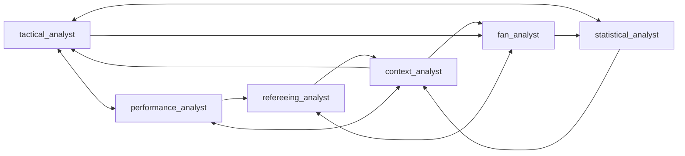
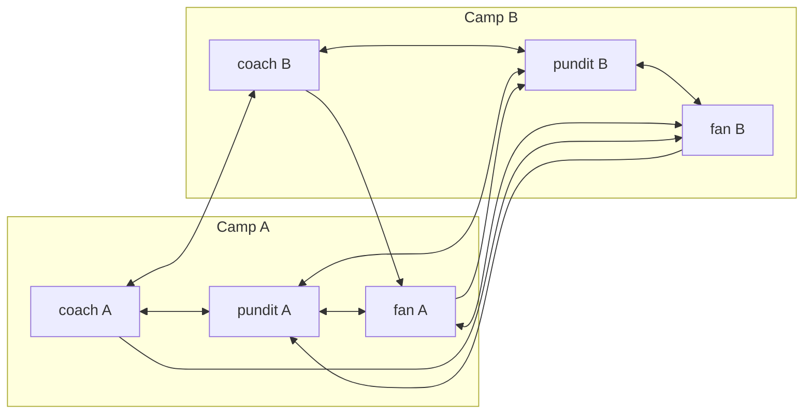

# Agent Graph and Message Routing

Agents do not broadcast to everyone. Each discussion has a **directed
communication graph** (`networkx.DiGraph`): an edge `A → B` means B receives
A's message in the next round. The graph is built in
`src/discussion/graph.py` and used through the stateless router in
`src/discussion/router.py`.

---

## 1. Which graph a discussion gets

The launch options decide the graph. They are the same from the CLI
(`run_discussion`) and the API (`POST /discussions`).

| Launch mode | Agents | Graph builder | Edges |
|---|---|---|---|
| Default, 6 agents | the six specialist personas in `personas/` | `DiscussionGraph()` (curated) | 15 |
| Default, 2–5 agents | first *n* of the default roster | `build_discussion_graph()` (ring + chords) | 2 · 6 · 12 · 15 |
| Dynamic personas (`--dynamic-personas` / `dynamic_personas: true`), 6 agents | 3v3 camps generated by the LLM | `create_symmetrical_3v3()` | 16 |
| Dynamic personas, 2–5 agents | camp members interleaved A/B: coach, coach, fan, fan, pundit | ring + chords | 2 · 6 · 12 · 15 |
| Chosen personas (`--persona-ids`, or `--camp-a-ids` + `--camp-b-ids`) | 2–6 system or user personas | ring + chords | depends on *n* |

The default roster order is `tactical_analyst`, `statistical_analyst`,
`performance_analyst`, `context_analyst`, `refereeing_analyst`, `fan_analyst`,
so a 3-agent default debate uses the first three.

Every builder checks `nx.is_strongly_connected()`: there is a directed path
from any agent to any other, so every argument can reach everyone.

---

## 2. The curated six-specialist graph

Used for the default 6-agent debate. Its 15 edges come in three groups.

**Reciprocal debate pairs (6 edges).** Direct two-way rebuttals between natural
counterparts:
- `tactical_analyst ↔ performance_analyst`: tactical system vs physical execution
- `tactical_analyst ↔ statistical_analyst`: tactical claims checked against data (xG, field tilt)
- `fan_analyst ↔ refereeing_analyst`: disputed decisions vs Law 12 / VAR protocol

**Host moderation (6 edges).** `context_analyst` acts as the studio host:
- prompts `fan_analyst`, `tactical_analyst` and `performance_analyst`
- receives syntheses from `statistical_analyst`, `refereeing_analyst` and `performance_analyst`

**Cross-domain bridges (3 edges).** `fan_analyst → statistical_analyst`,
`tactical_analyst → fan_analyst`, `performance_analyst → refereeing_analyst`.

Every agent sends to and receives from 2–3 others.

---

## 3. Ring + chords (2–6 agents, any personas)

`DiscussionGraph.build_dynamic_discussion_graph(agents)`:

1. **2 agents:** one edge each way.
2. **3+ agents:** a bidirectional ring (each agent ↔ its neighbours), plus one
   chord from each agent to the agent halfway around the ring.
3. If the result were ever not strongly connected, it falls back to a full mesh.

Edge counts: 2 agents → 2, 3 → 6, 4 → 12, 5 → 15, 6 → 18.

---

## 4. Symmetrical 3v3 camps (dynamic personas)

`--dynamic-personas` asks the LLM for two opposing camps, each with a
**coach**, a **fan** and a **pundit** (`src/agent/persona_generator.py`). The
personas are cached in `personas/generated/<discussion_id>/`; use
`--force-regenerate` to create new ones.

`DiscussionGraph.create_symmetrical_3v3(camp_a, camp_b)` builds 16 edges:

| Group | Edges |
|---|---|
| Cross-camp counterparts (6) | coach A ↔ coach B, fan A ↔ fan B, pundit A ↔ pundit B |
| Intra-camp consultation (8) | coach ↔ pundit and pundit ↔ fan, inside each camp |
| Cross-camp interrogation (4) | coach A → fan B, coach B → fan A, fan A → pundit B, fan B → pundit A |

---

## 5. Why a graph instead of a broadcast

- **Bounded context.** A full broadcast of 6 agents means every agent reads
  every message every round. The graph limits each inbox to 2–3 targeted
  messages, which keeps prompts small and replies specific.
- **Real rebuttals.** A plain one-way cycle has no reciprocity, so nobody could
  answer the agent who challenged them. The reciprocal pairs make direct
  back-and-forth possible.
- **Propagation.** Strong connectivity plus a small diameter means an idea
  introduced by anyone can reach everyone within a normal 3-round debate.

---

## 6. Routing

`GraphRouter.get_recipients(sender_id)` returns the sender's outgoing
neighbours as a list. The router keeps no inboxes or state: the
`DiscussionOrchestrator` (`src/discussion/orchestrator.py`) queues messages,
delivers them in the next round, and saves checkpoints. The router checks
strong connectivity when it is created and raises `ValueError` before any LLM
call if the graph is broken.

The graph used is saved as an adjacency list in the discussion record
(`config.graph`), so every run's routing can be reconstructed.

Tests: `tests/test_graph_routing.py`.
