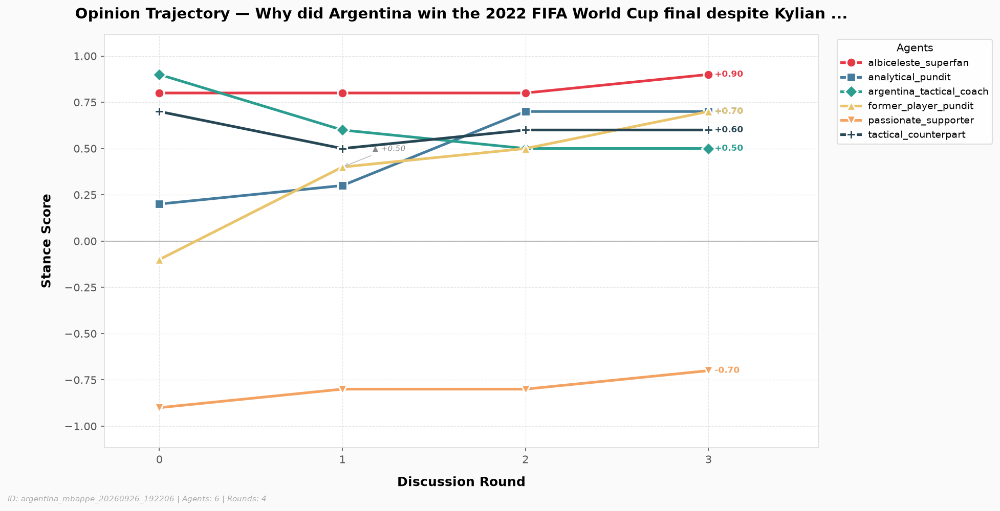
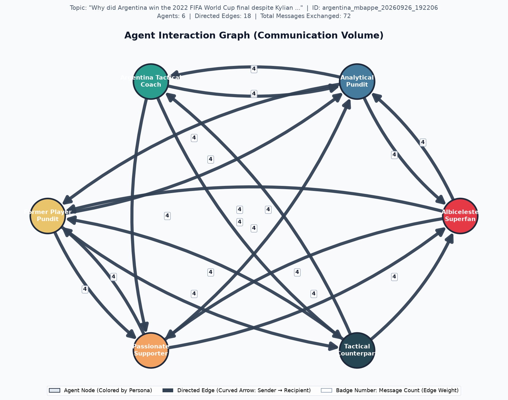

# Multi-Agent Discussion Analytics Report

> **Discussion ID:** `argentina_mbappe_20260926_192206`  
> **Topic:** *Why did Argentina win the 2022 FIFA World Cup final despite Kylian Mbappe scoring a hat-trick? Discuss tactics, Messi and Di Maria, France's comeback, Emiliano Martinez, and the penalty shootout.*  
> **Participating Agents:** 6  |  **Total Rounds:** 3

## Executive Overview

| Metric Dimension | Measurement Summary | Status / Trend |
| :--- | :--- | :--- |
| **Discussion Consensus** | Initial: 0.593 → Final: 0.710 | `Converging` (+0.117) |
| **Lead Influencer (Correlation)** | `passionate_supporter` (score: +0.834) | Pearson $r$ correlation |
| **Lead Persuader (Causal)** | `albiceleste_superfan` (mean shift: +0.078) | Counterfactual message ablation |
| **Dialogue Tone** | Mean Compound: -0.152 (24/24 messages) | Pos: 41.7% / Neg: 54.2% |
| **Stance Scoring Method** | `llm` (Cached reuse: `False`) | Verified integrity |

---
## Key Insights

Key Insights were not requested. Enable them with `--key-insights`.

---
## 1. Opinion Dynamics & Stance Evolution

Tracks each agent's quantitative position over time on the normalized stance scale $[-1.0, +1.0]$.

| Agent | Round 0 | Round 1 | Round 2 | Round 3 | Net Shift (Δ) | Final Position |
| :--- | :---: | :---: | :---: | :---: | :---: | :---: |
| **`albiceleste_superfan`** | +0.80 | +0.80 | +0.80 | +0.90 | +0.100 | Supportive (+) |
| **`analytical_pundit`** | +0.20 | +0.30 | +0.70 | +0.70 | +0.500 | Supportive (+) |
| **`argentina_tactical_coach`** | +0.90 | +0.60 | +0.50 | +0.50 | -0.400 | Supportive (+) |
| **`former_player_pundit`** | -0.10 | +0.40 | +0.50 | +0.70 | +0.800 | Supportive (+) |
| **`passionate_supporter`** | -0.90 | -0.80 | -0.80 | -0.70 | +0.200 | Opposed (-) |
| **`tactical_counterpart`** | +0.70 | +0.50 | +0.60 | +0.60 | -0.100 | Supportive (+) |

### Key Observations:
- **Greatest Opinion Mobility:** `former_player_pundit` exhibited the largest trajectory shift (|Δ| = 0.800).
- **Most Anchored Perspective:** `albiceleste_superfan` remained most steadfast across deliberation (|Δ| = 0.100).
- Stance changes reflect the integration of counter-arguments and empirical evidence retrieved across rounds.

---
## 2. Agreement & Group Consensus Dynamics

Pairwise agreement evaluates collective alignment across all agent dyads at each discussion round on a $[0.0, 1.0]$ scale (where $1.0$ is perfect consensus and $0.0$ is total polarization).

| Discussion Round | Agreement Score | Stance Dispersion (StdDev) | Dyad Range | Consensus State |
| :---: | :---: | :---: | :---: | :--- |
| Round 0 | 0.593 | 0.629 | [-0.90, +0.90] | Moderate Alignment |
| Round 1 | 0.700 | 0.516 | [-0.80, +0.80] | Moderate Alignment |
| Round 2 | 0.710 | 0.540 | [-0.80, +0.80] | Moderate Alignment |
| Round 3 | 0.710 | 0.528 | [-0.70, +0.90] | Moderate Alignment |

**Trajectory Classification:** The group demonstrated an overall **`Converging`** pattern with a net agreement shift of **+0.117**.

---
## 3. Agent Influence & Cross-Agent Persuasion

Influence measures how strongly each sender's communication associates with downstream opinion adjustments in their recipients. Evaluated via Pearson correlation between incoming message volume and subsequent recipient stance changes.

| Agent | Influence Score ($r$) | Statistical Status | Active Targets | Outbound Volume |
| :--- | :---: | :---: | :---: | :---: |
| **`albiceleste_superfan`** | -0.166 | `computed` | 3 | 9 msgs |
| **`analytical_pundit`** | +0.771 | `computed` | 3 | 9 msgs |
| **`argentina_tactical_coach`** | +0.113 | `computed` | 3 | 9 msgs |
| **`former_player_pundit`** | +0.267 | `computed` | 3 | 9 msgs |
| **`passionate_supporter`** | +0.834 | `computed` | 3 | 9 msgs |
| **`tactical_counterpart`** | +0.820 | `computed` | 3 | 9 msgs |

### Observational Correlation vs. Counterfactual Causal Attribution

> **Statistical Correlation vs. Cognitive Causation:**  
> While Pearson $r$ measures observational co-movement, **correlation does not imply causation**. In a fast-paced debate, two agents may appear correlated simply because both reacted to the same match statistics (confounding) or shared team loyalties. To isolate genuine persuasion, **Counterfactual Message Ablation** estimates what the recipient's stance would have been had the sender remained silent: $\tau = |S_{\text{factual}} - S_{\text{counterfactual}}|$.

| Agent Persona | Pearson Correlation ($r$) | Causal Impact (Mean $\tau$) | Evaluated Exchanges | Causal Classification |
| :--- | :---: | :---: | :---: | :--- |
| **`albiceleste_superfan`** | -0.166 | +0.078 | 9 | `Minor Nudge` |
| **`analytical_pundit`** | +0.771 | +0.056 | 9 | `Minor Nudge` |
| **`argentina_tactical_coach`** | +0.113 | +0.050 | 9 | `Minor Nudge` |
| **`former_player_pundit`** | +0.267 | +0.050 | 9 | `Minor Nudge` |
| **`passionate_supporter`** | +0.834 | +0.022 | 9 | `Minor Nudge` |
| **`tactical_counterpart`** | +0.820 | +0.030 | 9 | `Minor Nudge` |

#### Highlighted Counterfactual Persuasion Exchanges:

| Sender (Intervention) | Recipient | Round | Factual Stance | Counterfactual Stance ($S_{\neg A}$) | Causal Shift ($\tau$) | Mechanistic Rationale |
| :--- | :--- | :---: | :---: | :---: | :---: | :--- |
| `albiceleste_superfan` | `former_player_pundit` | Round 0 | +0.400 | +0.100 | **+0.300** | Recipient was significantly persuaded by the fan's emphasis on collective spirit and mentality. |
| `albiceleste_superfan` | `analytical_pundit` | Round 1 | +0.700 | +0.500 | **+0.200** | Superfan's strong pro-Argentina rhetoric pushed the recipient toward a more positive stance. |
| `analytical_pundit` | `former_player_pundit` | Round 0 | +0.400 | +0.200 | **+0.200** | Recipient moved toward tactical nuance after hearing analytical pundit's balanced perspective. |
| `passionate_supporter` | `analytical_pundit` | Round 1 | +0.700 | +0.500 | **+0.200** | Recipient was already trending toward tactical analysis from other peers. |
| `albiceleste_superfan` | `passionate_supporter` | Round 2 | -0.700 | -0.800 | **+0.100** | Recipient moved slightly toward center due to the superfan's tactical framing. |
| `albiceleste_superfan` | `former_player_pundit` | Round 2 | +0.700 | +0.600 | **+0.100** | Sender provided strong structural evidence that likely nudged the recipient upward. |

---
## 4. Communication Sentiment & Discourse Tone

Measures discourse tone using VADER sentiment analysis over all transmitted messages.

### Overall Corpus Sentiment:
- **Total Messages Analyzed:** 24 (24 scored)
- **Mean Compound Sentiment:** -0.152 (Scale: $[-1.0, +1.0]$)
- **Distribution:** Positive: `10` (41.7%) | Neutral: `1` (4.2%) | Negative: `13` (54.2%)

### Per-Agent Sentiment Profile:

| Agent | Messages Sent | Mean Compound | Tone Classification |
| :--- | :---: | :---: | :--- |
| **`albiceleste_superfan`** | 4 | -0.231 | Critical / Skeptical |
| **`analytical_pundit`** | 4 | -0.276 | Critical / Skeptical |
| **`argentina_tactical_coach`** | 4 | -0.207 | Critical / Skeptical |
| **`former_player_pundit`** | 4 | -0.104 | Critical / Skeptical |
| **`passionate_supporter`** | 4 | +0.462 | Constructive / Positive |
| **`tactical_counterpart`** | 4 | -0.558 | Critical / Skeptical |

---
## 5. Visualizations & Network Artifacts

### Opinion Trajectory Chart

### Agent Interaction Graph

---
## 6. Methodological Limitations & Integrity Disclosures

> **Exploratory Metric Notice:**  
> The correlation-based influence metric implemented here remains exploratory. It uses scalar opinion scores as a simplified numerical representation of complex multi-paragraph debate content and operates across a limited observation window (3–5 discussion rounds).

### Specific Technical Constraints:
1. **Content Abstraction:** Numeric stance values condense rich domain argumentation into a 1-dimensional scalar position $[-1.0, +1.0]$. Nuanced tactical qualifications or conditional agreements are necessarily compressed.
2. **Statistical Power:** Deliberations of 3 to 5 rounds yield limited time-series observations per agent dyad. Correlation coefficients ($r$) require cautious interpretation and reflect directional association rather than causal proof.
3. **Alignment vs. Correctness:** Group agreement measures internal consensus among the participating agent personas; it does not measure or guarantee factual truth or objective football correctness.
4. **Missing Data Handling:** Incomplete rounds, unclassified stances, or invariant trajectories are retained as explicit `null` / `None` values to guarantee transparency and eliminate synthetic score fabrication.

---
*Report automatically generated by Week 4 Discussion Analytics Engine. Discussion ID: `argentina_mbappe_20260926_192206`.*
