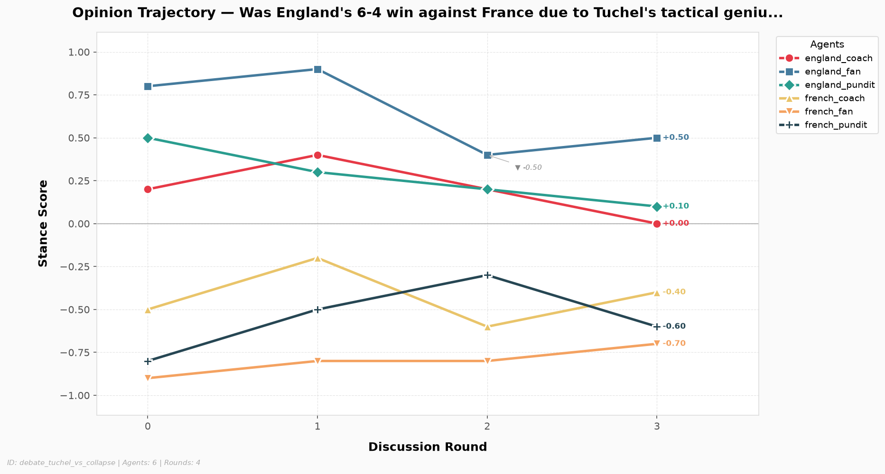
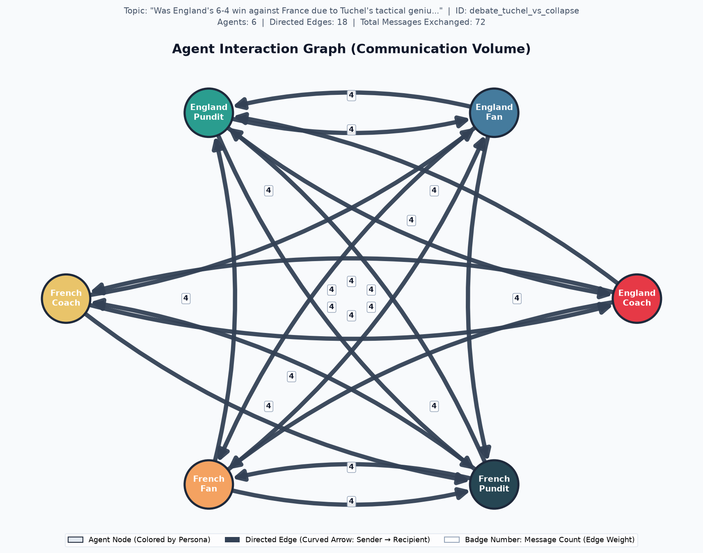

# Multi-Agent Discussion Analytics Report

> **Discussion ID:** `debate_tuchel_vs_collapse`  
> **Topic:** *Was England's 6-4 win against France due to Tuchel's tactical genius or French defensive collapse?*  
> **Participating Agents:** 6  |  **Total Rounds:** 3

## Executive Overview

| Metric Dimension | Measurement Summary | Status / Trend |
| :--- | :--- | :--- |
| **Discussion Consensus** | Initial: 0.563 → Final: 0.717 | `Converging` (+0.153) |
| **Lead Influencer (Correlation)** | `england_fan` (score: +0.750) | Pearson $r$ correlation |
| **Lead Persuader (Causal)** | `england_coach` (mean shift: +0.039) | Counterfactual message ablation |
| **Dialogue Tone** | Mean Compound: -0.816 (24/24 messages) | Pos: 8.3% / Neg: 91.7% |
| **Stance Scoring Method** | `llm` (Cached reuse: `False`) | Verified integrity |

---
## 1. Opinion Dynamics & Stance Evolution

Tracks each agent's quantitative position over time on the normalized stance scale $[-1.0, +1.0]$.

| Agent | Round 0 | Round 1 | Round 2 | Round 3 | Net Shift (Δ) | Final Position |
| :--- | :---: | :---: | :---: | :---: | :---: | :---: |
| **`england_coach`** | +0.20 | +0.40 | +0.20 | +0.00 | -0.200 | Moderate / Neutral |
| **`england_fan`** | +0.80 | +0.90 | +0.40 | +0.50 | -0.300 | Supportive (+) |
| **`england_pundit`** | +0.50 | +0.30 | +0.20 | +0.10 | -0.400 | Moderate / Neutral |
| **`french_coach`** | -0.50 | -0.20 | -0.60 | -0.40 | +0.100 | Opposed (-) |
| **`french_fan`** | -0.90 | -0.80 | -0.80 | -0.70 | +0.200 | Opposed (-) |
| **`french_pundit`** | -0.80 | -0.50 | -0.30 | -0.60 | +0.200 | Opposed (-) |

### Key Observations:
- **Greatest Opinion Mobility:** `england_pundit` exhibited the largest trajectory shift (|Δ| = 0.400).
- **Most Anchored Perspective:** `french_coach` remained most steadfast across deliberation (|Δ| = 0.100).
- Stance changes reflect the integration of counter-arguments and empirical evidence retrieved across rounds.

---
## 2. Agreement & Group Consensus Dynamics

Pairwise agreement evaluates collective alignment across all agent dyads at each discussion round on a $[0.0, 1.0]$ scale (where $1.0$ is perfect consensus and $0.0$ is total polarization).

| Discussion Round | Agreement Score | Stance Dispersion (StdDev) | Dyad Range | Consensus State |
| :---: | :---: | :---: | :---: | :--- |
| Round 0 | 0.563 | 0.652 | [-0.90, +0.80] | Moderate Alignment |
| Round 1 | 0.610 | 0.576 | [-0.80, +0.90] | Moderate Alignment |
| Round 2 | 0.703 | 0.446 | [-0.80, +0.40] | Moderate Alignment |
| Round 3 | 0.717 | 0.422 | [-0.70, +0.50] | Moderate Alignment |

**Trajectory Classification:** The group demonstrated an overall **`Converging`** pattern with a net agreement shift of **+0.153**.

---
## 3. Agent Influence & Cross-Agent Persuasion

Influence measures how strongly each sender's communication associates with downstream opinion adjustments in their recipients. Evaluated via Pearson correlation between incoming message volume and subsequent recipient stance changes.

| Agent | Influence Score ($r$) | Statistical Status | Active Targets | Outbound Volume |
| :--- | :---: | :---: | :---: | :---: |
| **`england_coach`** | +0.493 | `computed` | 3 | 9 msgs |
| **`england_fan`** | +0.750 | `computed` | 3 | 9 msgs |
| **`england_pundit`** | +0.602 | `computed` | 3 | 9 msgs |
| **`french_coach`** | +0.417 | `computed` | 3 | 9 msgs |
| **`french_fan`** | +0.510 | `computed` | 3 | 9 msgs |
| **`french_pundit`** | +0.514 | `computed` | 3 | 9 msgs |

### Observational Correlation vs. Counterfactual Causal Attribution

> **Statistical Correlation vs. Cognitive Causation:**  
> While Pearson $r$ measures observational co-movement, **correlation does not imply causation**. In a fast-paced debate, two agents may appear correlated simply because both reacted to the same match statistics (confounding) or shared team loyalties. To isolate genuine persuasion, **Counterfactual Message Ablation** estimates what the recipient's stance would have been had the sender remained silent: $\tau = |S_{\text{factual}} - S_{\text{counterfactual}}|$.

| Agent Persona | Pearson Correlation ($r$) | Causal Impact (Mean $\tau$) | Evaluated Exchanges | Causal Classification |
| :--- | :---: | :---: | :---: | :--- |
| **`england_coach`** | +0.493 | +0.039 | 9 | `Minor Nudge` |
| **`england_fan`** | +0.750 | +0.011 | 9 | `Zero Causal Shift (Rigid / Ineffective)` |
| **`england_pundit`** | +0.602 | +0.022 | 9 | `Minor Nudge` |
| **`french_coach`** | +0.417 | +0.019 | 9 | `Zero Causal Shift (Rigid / Ineffective)` |
| **`french_fan`** | +0.510 | +0.039 | 9 | `Minor Nudge` |
| **`french_pundit`** | +0.514 | +0.022 | 9 | `Minor Nudge` |

#### Highlighted Counterfactual Persuasion Exchanges:

| Sender (Intervention) | Recipient | Round | Factual Stance | Counterfactual Stance ($S_{\neg A}$) | Causal Shift ($\tau$) | Mechanistic Rationale |
| :--- | :--- | :---: | :---: | :---: | :---: | :--- |
| `french_fan` | `french_pundit` | Round 2 | -0.600 | -0.400 | **+0.200** | French fan reinforced existing defensive collapse narrative, pulling stance slightly more negative. |
| `england_coach` | `french_coach` | Round 0 | -0.200 | -0.300 | **+0.100** | Slight influence from England coach on tactical framing, but mostly aligned with pundit. |
| `england_coach` | `french_coach` | Round 1 | -0.600 | -0.500 | **+0.100** | Slight shift driven mostly by french_pundit input rather than england_coach. |
| `england_coach` | `french_coach` | Round 2 | -0.400 | -0.500 | **+0.100** | Minimal shift caused by sender; recipient's position largely shaped by french_pundit. |
| `england_fan` | `french_pundit` | Round 0 | -0.500 | -0.600 | **+0.100** | Sender moderate influence; recipient shifted toward neutral due to multiple competing peers. |
| `england_pundit` | `french_pundit` | Round 0 | -0.500 | -0.600 | **+0.100** | Moderate independent shift driven largely by aggregate debate dynamics rather than this sender alone. |

---
## 4. Communication Sentiment & Discourse Tone

Measures discourse tone using VADER sentiment analysis over all transmitted messages.

### Overall Corpus Sentiment:
- **Total Messages Analyzed:** 24 (24 scored)
- **Mean Compound Sentiment:** -0.816 (Scale: $[-1.0, +1.0]$)
- **Distribution:** Positive: `2` (8.3%) | Neutral: `0` (0.0%) | Negative: `22` (91.7%)

### Per-Agent Sentiment Profile:

| Agent | Messages Sent | Mean Compound | Tone Classification |
| :--- | :---: | :---: | :--- |
| **`england_coach`** | 4 | -0.935 | Critical / Skeptical |
| **`england_fan`** | 4 | -0.474 | Critical / Skeptical |
| **`england_pundit`** | 4 | -0.620 | Critical / Skeptical |
| **`french_coach`** | 4 | -0.958 | Critical / Skeptical |
| **`french_fan`** | 4 | -0.948 | Critical / Skeptical |
| **`french_pundit`** | 4 | -0.959 | Critical / Skeptical |

---
## 5. Visualizations & Network Artifacts

### Opinion Trajectory Chart

### Agent Interaction Graph

---
## 6. Methodological Limitations & Integrity Disclosures

> **Exploratory Metric Notice:**  
> The correlation-based influence metric implemented here remains exploratory. It uses scalar opinion scores as a simplified numerical representation of complex multi-paragraph debate content and operates across a limited observation window (3–5 discussion rounds).

### Specific Technical Constraints:
1. **Content Abstraction:** Numeric stance values condense rich domain argumentation into a 1-dimensional scalar position $[-1.0, +1.0]$. Nuanced tactical qualifications or conditional agreements are necessarily compressed.
2. **Statistical Power:** Deliberations of 3 to 5 rounds yield limited time-series observations per agent dyad. Correlation coefficients ($r$) require cautious interpretation and reflect directional association rather than causal proof.
3. **Alignment vs. Correctness:** Group agreement measures internal consensus among the participating agent personas; it does not measure or guarantee factual truth or objective football correctness.
4. **Missing Data Handling:** Incomplete rounds, unclassified stances, or invariant trajectories are retained as explicit `null` / `None` values to guarantee transparency and eliminate synthetic score fabrication.

---
*Report automatically generated by Week 4 Discussion Analytics Engine. Discussion ID: `debate_tuchel_vs_collapse`.*
