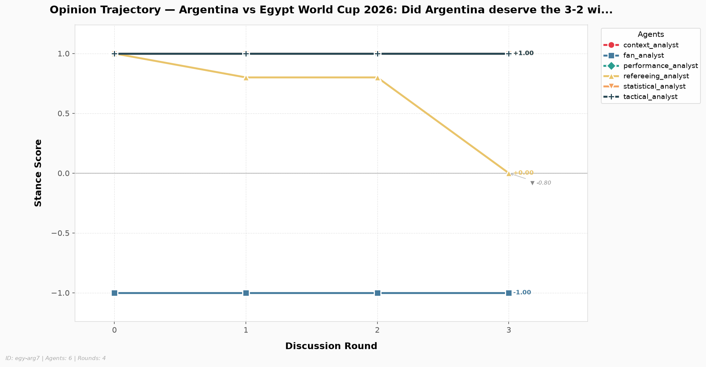
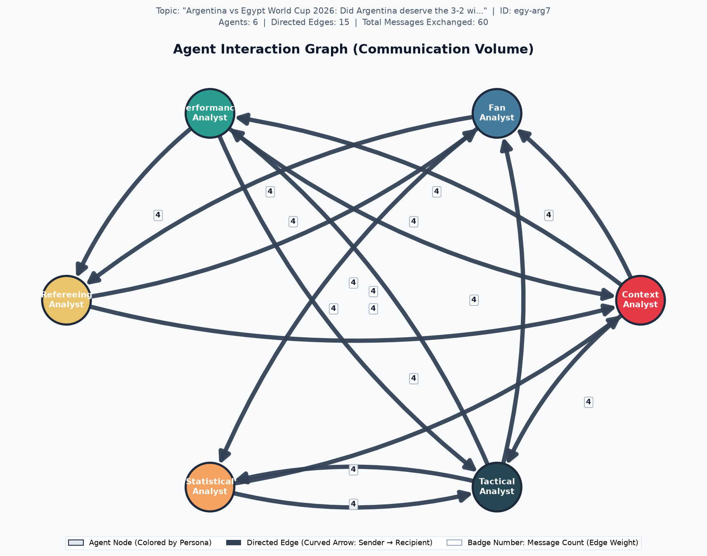

# Multi-Agent Discussion Analytics Report

> **Discussion ID:** `egy-arg7`  
> **Topic:** *Argentina vs Egypt World Cup 2026: Did Argentina deserve the 3-2 win or did the match official influence the result?*  
> **Participating Agents:** 6  |  **Total Rounds:** 3

## Executive Overview

| Metric Dimension | Measurement Summary | Status / Trend |
| :--- | :--- | :--- |
| **Discussion Consensus** | Initial: 0.667 → Final: 0.567 | `Diverging` (-0.100) |
| **Lead Influencer** | `fan_analyst` (score: -0.564) | Pearson $r$ correlation |
| **Dialogue Tone** | Mean Compound: -0.298 (24/24 messages) | Pos: 33.3% / Neg: 62.5% |
| **Stance Scoring Method** | `llm` (Cached reuse: `False`) | Verified integrity |

---
## 1. Opinion Dynamics & Stance Evolution

Tracks each agent's quantitative position over time on the normalized stance scale $[-1.0, +1.0]$.

| Agent | Round 0 | Round 1 | Round 2 | Round 3 | Net Shift (Δ) | Final Position |
| :--- | :---: | :---: | :---: | :---: | :---: | :---: |
| **`context_analyst`** | +1.00 | +1.00 | +1.00 | +1.00 | +0.000 | Supportive (+) |
| **`fan_analyst`** | -1.00 | -1.00 | -1.00 | -1.00 | +0.000 | Opposed (-) |
| **`performance_analyst`** | +1.00 | +1.00 | +1.00 | +1.00 | +0.000 | Supportive (+) |
| **`refereeing_analyst`** | +1.00 | +0.80 | +0.80 | +0.00 | -1.000 | Moderate / Neutral |
| **`statistical_analyst`** | +1.00 | +1.00 | +1.00 | +1.00 | +0.000 | Supportive (+) |
| **`tactical_analyst`** | +1.00 | +1.00 | +1.00 | +1.00 | +0.000 | Supportive (+) |

### Key Observations:
- **Greatest Opinion Mobility:** `refereeing_analyst` exhibited the largest trajectory shift (|Δ| = 1.000).
- **Most Anchored Perspective:** `context_analyst` remained most steadfast across deliberation (|Δ| = 0.000).
- Stance changes reflect the integration of counter-arguments and empirical evidence retrieved across rounds.

---
## 2. Agreement & Group Consensus Dynamics

Pairwise agreement evaluates collective alignment across all agent dyads at each discussion round on a $[0.0, 1.0]$ scale (where $1.0$ is perfect consensus and $0.0$ is total polarization).

| Discussion Round | Agreement Score | Stance Dispersion (StdDev) | Dyad Range | Consensus State |
| :---: | :---: | :---: | :---: | :--- |
| Round 0 | 0.667 | 0.745 | [-1.00, +1.00] | Moderate Alignment |
| Round 1 | 0.647 | 0.734 | [-1.00, +1.00] | Moderate Alignment |
| Round 2 | 0.647 | 0.734 | [-1.00, +1.00] | Moderate Alignment |
| Round 3 | 0.567 | 0.764 | [-1.00, +1.00] | Moderate Alignment |

**Trajectory Classification:** The group demonstrated an overall **`Diverging`** pattern with a net agreement shift of **-0.100**.

---
## 3. Agent Influence & Cross-Agent Persuasion

Influence measures how strongly each sender's communication associates with downstream opinion adjustments in their recipients. Evaluated via Pearson correlation between incoming message volume and subsequent recipient stance changes.

| Agent | Influence Score ($r$) | Statistical Status | Active Targets | Outbound Volume |
| :--- | :---: | :---: | :---: | :---: |
| **`context_analyst`** | N/A | `constant_signal` | 3 | 9 msgs |
| **`fan_analyst`** | -0.564 | `computed` | 2 | 6 msgs |
| **`performance_analyst`** | -0.614 | `computed` | 3 | 9 msgs |
| **`refereeing_analyst`** | N/A | `constant_signal` | 2 | 6 msgs |
| **`statistical_analyst`** | N/A | `constant_signal` | 2 | 6 msgs |
| **`tactical_analyst`** | N/A | `constant_signal` | 3 | 9 msgs |

---
## 4. Communication Sentiment & Discourse Tone

Measures discourse tone using VADER sentiment analysis over all transmitted messages.

### Overall Corpus Sentiment:
- **Total Messages Analyzed:** 24 (24 scored)
- **Mean Compound Sentiment:** -0.298 (Scale: $[-1.0, +1.0]$)
- **Distribution:** Positive: `8` (33.3%) | Neutral: `1` (4.2%) | Negative: `15` (62.5%)

### Per-Agent Sentiment Profile:

| Agent | Messages Sent | Mean Compound | Tone Classification |
| :--- | :---: | :---: | :--- |
| **`context_analyst`** | 4 | -0.296 | Critical / Skeptical |
| **`fan_analyst`** | 4 | +0.194 | Constructive / Positive |
| **`performance_analyst`** | 4 | -0.116 | Critical / Skeptical |
| **`refereeing_analyst`** | 4 | -0.673 | Critical / Skeptical |
| **`statistical_analyst`** | 4 | -0.033 | Objective / Neutral |
| **`tactical_analyst`** | 4 | -0.866 | Critical / Skeptical |

---
## 5. Visualizations & Network Artifacts

### Opinion Trajectory Chart

### Agent Interaction Graph

---
## 6. Methodological Limitations & Integrity Disclosures

> **Exploratory Metric Notice:**  
> The correlation-based influence metric implemented here remains exploratory. It uses scalar opinion scores as a simplified numerical representation of complex multi-paragraph debate content and operates across a limited observation window (3–5 discussion rounds).

### Specific Technical Constraints:
1. **Content Abstraction:** Numeric stance values condense rich domain argumentation into a 1-dimensional scalar position $[-1.0, +1.0]$. Nuanced tactical qualifications or conditional agreements are necessarily compressed.
2. **Statistical Power:** Deliberations of 3 to 5 rounds yield limited time-series observations per agent dyad. Correlation coefficients ($r$) require cautious interpretation and reflect directional association rather than causal proof.
3. **Alignment vs. Correctness:** Group agreement measures internal consensus among the participating agent personas; it does not measure or guarantee factual truth or objective football correctness.
4. **Missing Data Handling:** Incomplete rounds, unclassified stances, or invariant trajectories are retained as explicit `null` / `None` values to guarantee transparency and eliminate synthetic score fabrication.

---
*Report automatically generated by Week 4 Discussion Analytics Engine. Discussion ID: `egy-arg7`.*
