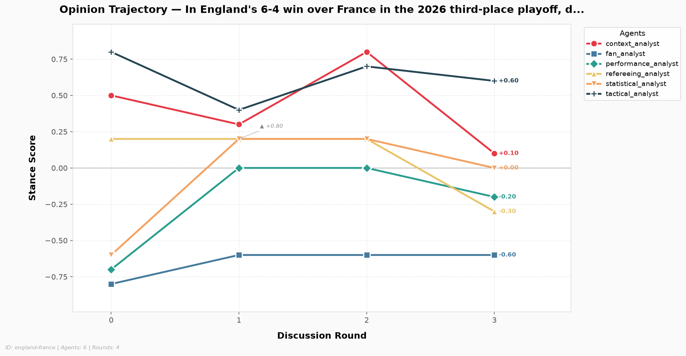
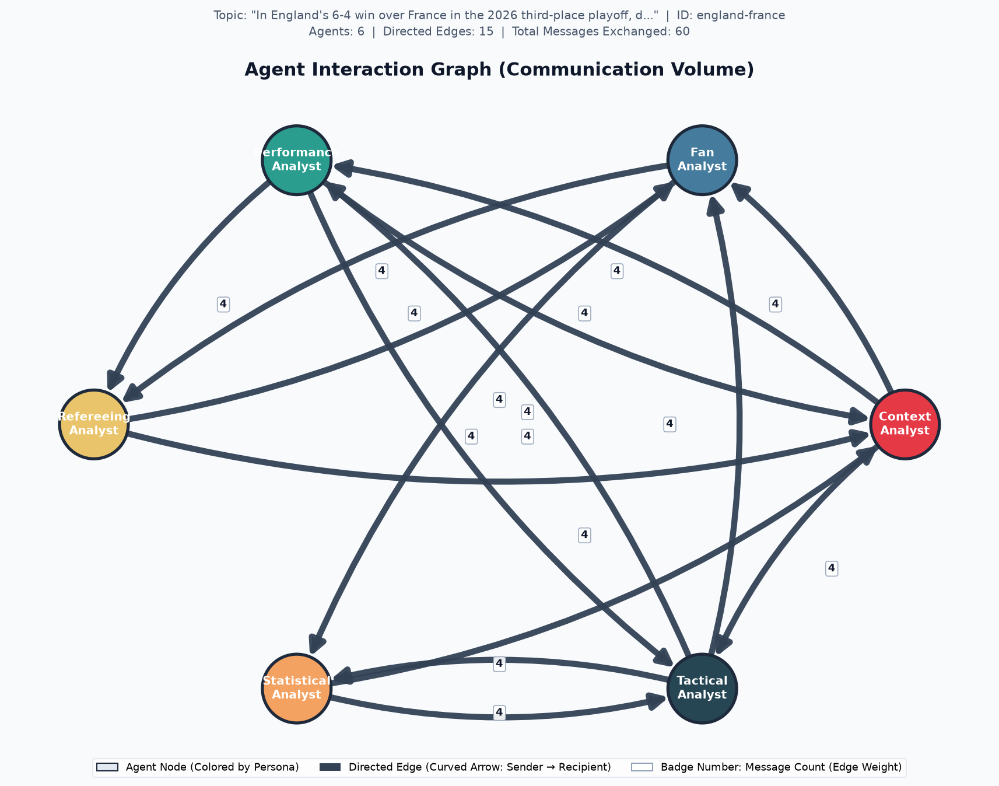

# Multi-Agent Discussion Analytics Report

> **Discussion ID:** `england-france`  
> **Topic:** *In England's 6-4 win over France in the 2026 third-place playoff, did Thomas Tuchel's aggressive front-foot lineup (starting Saka, Eze, and Rashford while benching Kane) tactically dismantle France, or was the 10-goal chaos purely the product of Miami heat and end-of-tournament physical exhaustion?*  
> **Participating Agents:** 6  |  **Total Rounds:** 3

## Executive Overview

| Metric Dimension | Measurement Summary | Status / Trend |
| :--- | :--- | :--- |
| **Discussion Consensus** | Initial: 0.587 → Final: 0.753 | `Converging` (+0.167) |
| **Lead Influencer (Correlation)** | `fan_analyst` (score: +0.804) | Pearson $r$ correlation |
| **Lead Persuader (Causal)** | `fan_analyst` (mean shift: +0.100) | Counterfactual message ablation |
| **Dialogue Tone** | Mean Compound: -0.770 (24/24 messages) | Pos: 12.5% / Neg: 87.5% |
| **Stance Scoring Method** | `llm` (Cached reuse: `False`) | Verified integrity |

---
## 1. Opinion Dynamics & Stance Evolution

Tracks each agent's quantitative position over time on the normalized stance scale $[-1.0, +1.0]$.

| Agent | Round 0 | Round 1 | Round 2 | Round 3 | Net Shift (Δ) | Final Position |
| :--- | :---: | :---: | :---: | :---: | :---: | :---: |
| **`context_analyst`** | +0.50 | +0.30 | +0.80 | +0.10 | -0.400 | Moderate / Neutral |
| **`fan_analyst`** | -0.80 | -0.60 | -0.60 | -0.60 | +0.200 | Opposed (-) |
| **`performance_analyst`** | -0.70 | +0.00 | +0.00 | -0.20 | +0.500 | Moderate / Neutral |
| **`refereeing_analyst`** | +0.20 | +0.20 | +0.20 | -0.30 | -0.500 | Opposed (-) |
| **`statistical_analyst`** | -0.60 | +0.20 | +0.20 | +0.00 | +0.600 | Moderate / Neutral |
| **`tactical_analyst`** | +0.80 | +0.40 | +0.70 | +0.60 | -0.200 | Supportive (+) |

### Key Observations:
- **Greatest Opinion Mobility:** `statistical_analyst` exhibited the largest trajectory shift (|Δ| = 0.600).
- **Most Anchored Perspective:** `fan_analyst` remained most steadfast across deliberation (|Δ| = 0.200).
- Stance changes reflect the integration of counter-arguments and empirical evidence retrieved across rounds.

---
## 2. Agreement & Group Consensus Dynamics

Pairwise agreement evaluates collective alignment across all agent dyads at each discussion round on a $[0.0, 1.0]$ scale (where $1.0$ is perfect consensus and $0.0$ is total polarization).

| Discussion Round | Agreement Score | Stance Dispersion (StdDev) | Dyad Range | Consensus State |
| :---: | :---: | :---: | :---: | :--- |
| Round 0 | 0.587 | 0.627 | [-0.80, +0.80] | Moderate Alignment |
| Round 1 | 0.803 | 0.329 | [-0.60, +0.40] | High Consensus |
| Round 2 | 0.697 | 0.463 | [-0.60, +0.80] | Moderate Alignment |
| Round 3 | 0.753 | 0.373 | [-0.60, +0.60] | High Consensus |

**Trajectory Classification:** The group demonstrated an overall **`Converging`** pattern with a net agreement shift of **+0.167**.

---
## 3. Agent Influence & Cross-Agent Persuasion

Influence measures how strongly each sender's communication associates with downstream opinion adjustments in their recipients. Evaluated via Pearson correlation between incoming message volume and subsequent recipient stance changes.

| Agent | Influence Score ($r$) | Statistical Status | Active Targets | Outbound Volume |
| :--- | :---: | :---: | :---: | :---: |
| **`context_analyst`** | +0.439 | `computed` | 3 | 9 msgs |
| **`fan_analyst`** | +0.804 | `computed` | 2 | 6 msgs |
| **`performance_analyst`** | +0.388 | `computed` | 3 | 9 msgs |
| **`refereeing_analyst`** | +0.498 | `computed` | 2 | 6 msgs |
| **`statistical_analyst`** | +0.666 | `computed` | 2 | 6 msgs |
| **`tactical_analyst`** | +0.662 | `computed` | 3 | 9 msgs |

### Observational Correlation vs. Counterfactual Causal Attribution

> **Statistical Correlation vs. Cognitive Causation:**  
> While Pearson $r$ measures observational co-movement, **correlation does not imply causation**. In a fast-paced debate, two agents may appear correlated simply because both reacted to the same match statistics (confounding) or shared team loyalties. To isolate genuine persuasion, **Counterfactual Message Ablation** estimates what the recipient's stance would have been had the sender remained silent: $\tau = |S_{\text{factual}} - S_{\text{counterfactual}}|$.

| Agent Persona | Pearson Correlation ($r$) | Causal Impact (Mean $\tau$) | Evaluated Exchanges | Causal Classification |
| :--- | :---: | :---: | :---: | :--- |
| **`context_analyst`** | +0.439 | +0.044 | 9 | `Minor Nudge` |
| **`fan_analyst`** | +0.804 | +0.100 | 6 | `Minor Nudge` |
| **`performance_analyst`** | +0.388 | +0.022 | 9 | `Minor Nudge` |
| **`refereeing_analyst`** | +0.498 | +0.017 | 6 | `Zero Causal Shift (Rigid / Ineffective)` |
| **`statistical_analyst`** | +0.666 | +0.025 | 6 | `Minor Nudge` |
| **`tactical_analyst`** | +0.662 | +0.083 | 9 | `Minor Nudge` |

#### Highlighted Counterfactual Persuasion Exchanges:

| Sender (Intervention) | Recipient | Round | Factual Stance | Counterfactual Stance ($S_{\neg A}$) | Causal Shift ($\tau$) | Mechanistic Rationale |
| :--- | :--- | :---: | :---: | :---: | :---: | :--- |
| `fan_analyst` | `statistical_analyst` | Round 0 | +0.200 | -0.400 | **+0.600** | Without fan_analyst, recipient's shift would be entirely driven by tactical_analyst instead. |
| `tactical_analyst` | `statistical_analyst` | Round 0 | +0.200 | -0.200 | **+0.400** | Recipient was directly persuaded by tactical_analyst regarding structural spatial exploitation. |
| `tactical_analyst` | `performance_analyst` | Round 0 | +0.000 | -0.300 | **+0.300** | Direct tactical evidence from sender significantly pulled recipient toward positive territory. |
| `context_analyst` | `performance_analyst` | Round 0 | +0.000 | -0.200 | **+0.200** | Sender provided strong tactical rationale that shifted recipient upward from baseline. |
| `context_analyst` | `fan_analyst` | Round 0 | -0.600 | -0.700 | **+0.100** | Recipient heard similar tactical arguments from others; minimal independent shift from this sender. |
| `context_analyst` | `tactical_analyst` | Round 0 | +0.400 | +0.500 | **+0.100** | Recipient already leaned positive; shift driven more by performance and statistical peers. |

---
## 4. Communication Sentiment & Discourse Tone

Measures discourse tone using VADER sentiment analysis over all transmitted messages.

### Overall Corpus Sentiment:
- **Total Messages Analyzed:** 24 (24 scored)
- **Mean Compound Sentiment:** -0.770 (Scale: $[-1.0, +1.0]$)
- **Distribution:** Positive: `3` (12.5%) | Neutral: `0` (0.0%) | Negative: `21` (87.5%)

### Per-Agent Sentiment Profile:

| Agent | Messages Sent | Mean Compound | Tone Classification |
| :--- | :---: | :---: | :--- |
| **`context_analyst`** | 4 | -0.281 | Critical / Skeptical |
| **`fan_analyst`** | 4 | -0.963 | Critical / Skeptical |
| **`performance_analyst`** | 4 | -0.926 | Critical / Skeptical |
| **`refereeing_analyst`** | 4 | -0.970 | Critical / Skeptical |
| **`statistical_analyst`** | 4 | -0.942 | Critical / Skeptical |
| **`tactical_analyst`** | 4 | -0.536 | Critical / Skeptical |

---
## 5. Visualizations & Network Artifacts

### Opinion Trajectory Chart

### Agent Interaction Graph

---
## 6. Methodological Limitations & Integrity Disclosures

> **Exploratory Metric Notice:**  
> The correlation-based influence metric implemented here remains exploratory. It uses scalar opinion scores as a simplified numerical representation of complex multi-paragraph debate content and operates across a limited observation window (3–5 discussion rounds).

### Specific Technical Constraints:
1. **Content Abstraction:** Numeric stance values condense rich domain argumentation into a 1-dimensional scalar position $[-1.0, +1.0]$. Nuanced tactical qualifications or conditional agreements are necessarily compressed.
2. **Statistical Power:** Deliberations of 3 to 5 rounds yield limited time-series observations per agent dyad. Correlation coefficients ($r$) require cautious interpretation and reflect directional association rather than causal proof.
3. **Alignment vs. Correctness:** Group agreement measures internal consensus among the participating agent personas; it does not measure or guarantee factual truth or objective football correctness.
4. **Missing Data Handling:** Incomplete rounds, unclassified stances, or invariant trajectories are retained as explicit `null` / `None` values to guarantee transparency and eliminate synthetic score fabrication.

---
*Report automatically generated by Week 4 Discussion Analytics Engine. Discussion ID: `england-france`.*
